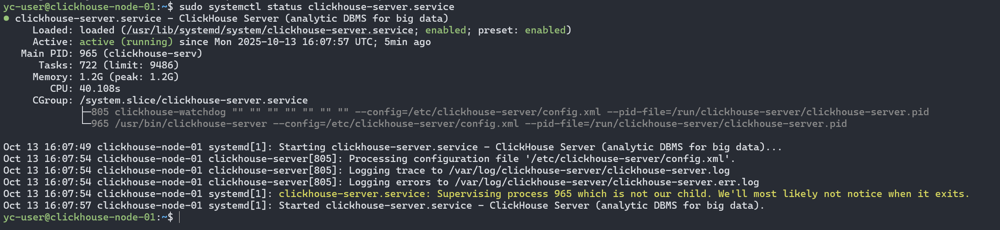
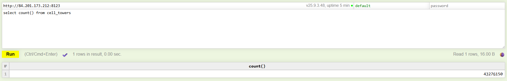
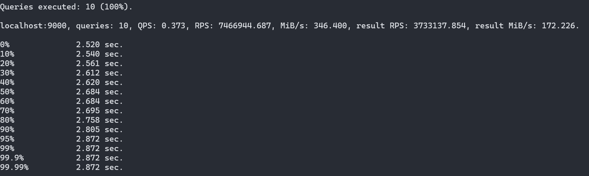
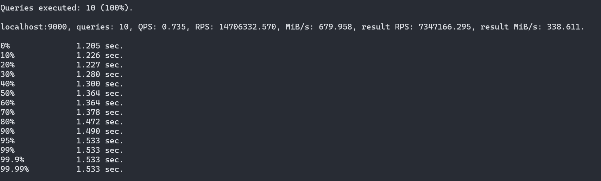

# Домашнее задание

## Установка и загрузка датасета

1. Установите ClickHouse.
2. Загрузите тестовый датасет и выполните выборку из таблицы.
3. Отправьте скриншоты работающего инстанса ClickHouse, созданной виртуальной машины (если выполняете работу в ЯО) и результата SQL запроса.

```sql
select count() from cell_towers
```

---

Запущенный инстанс ClickHouse:


Руководствуясь [инструкций с официального сайта ClickHouse](https://clickhouse.com/docs/getting-started/example-datasets/cell-towers), выполним загрузку датасета Cell Tower.

Перед загрузкой датасета, создадим таблицу, где будут хранится данные:

```sql
CREATE TABLE cell_towers
(
    radio Enum8('' = 0, 'CDMA' = 1, 'GSM' = 2, 'LTE' = 3, 'NR' = 4, 'UMTS' = 5),
    mcc UInt16,
    net UInt16,
    area UInt16,
    cell UInt64,
    unit Int16,
    lon Float64,
    lat Float64,
    range UInt32,
    samples UInt32,
    changeable UInt8,
    created DateTime,
    updated DateTime,
    averageSignal UInt8
)
ENGINE = MergeTree ORDER BY (radio, mcc, net, created);
```

А затем выполним вставку данных в таблицу из датасета, который доступен по сети в виде сжатого csv файла:

```sql
INSERT INTO cell_towers SELECT * FROM s3('https://datasets-documentation.s3.amazonaws.com/cell_towers/cell_towers.csv.xz', 'CSVWithNames')
```

После выполнения команды выше, проверим наличие данных внутри таблицы при помощи команды

```sql
select count() from cell_towers
```

В результате команды увидим общее число записей в таблице:


## Изучить конфигурационные файлы БД, произвести оптимальную настройку и провести тесты производительности на разных настройках

1. Изучить конфигурационные файлы БД.
2. Произвести наиболее оптимальную настройку системы на основании характеристик вашей ОС и провести повторное тестирование.

---

Как известно, конфигурация ClickHouse по умолчанию имеет достаточно хорошо сконфигурированный с точки зрения оптимизации вид. Поэтому, в рамках задания сначала будет выполнено тестирование на неоптимальных настройках.

Тестирование на неоптимальных настройках:

```bash
echo "SELECT * FROM default.cell_towers LIMIT 10000000 OFFSET 10000000 SETTINGS max_threads=1, use_uncompressed_cache=0, max_block_size=1024" | clickhouse-benchmark -i 10
```

Пояснения к параметрам:

- `max_threads=1` - ограничит выполнение запроса лишь одним потоком;
- `use_uncompressed_cache=0` - отключит кэш распакованных блоков, поэтому каждый блок придётся распаковывать заново;
- `max_block_size=1024` - уменьшит объём одного блока до указанного значения (блоки большего размера обрабатываются более эффективно).

Результаты тестирования:


Для тестирования производительности на оптимальных настройках будем использовать следующую команду:

```bash
echo "SELECT * FROM default.cell_towers LIMIT 10000000 OFFSET 10000000" | clickhouse-benchmark -i 10
```

Результаты тестирования:


Как видим из результатов, производительность на оптимальных настройках возросла примерно в два раза, из чего следует вывод, что настройки инсталляции могут оказывать сильное влияние на скорость выполнения запросов.
