# Домашнее задание

## Создайте новую базу данных и перейдите в неё

Выполним запрос для создания базы данных и переключимся на неё:

```sql
CREATE DATABASE lesson_5_db;
USE restaurant_db;
```

## Разработка таблицы для бизнес-кейса "Меню ресторана"

> Наполните таблицу данными, используя модификаторы (например, Nullable, LowCardinality), где это необходимо. Не забудьте добавить комментарии к полям.

Создадим таблицу при помощи следующего запроса:

```sql
CREATE TABLE menu (
    id UInt32 COMMENT 'ID блюда',
    name String COMMENT 'Название блюда',
    cuisine LowCardinality(Nullable(String)) COMMENT 'Кухня (Русская, азиатская и т. д.)',
    category LowCardinality(String) COMMENT 'Категория (Первое, второе, напитки и т. д.)',
    price Decimal(10, 2) COMMENT 'Цена',
    description String COMMENT 'Описание'
)
ENGINE = MergeTree
ORDER BY id;
```

## Протестируйте выполнение операций CRUD на созданной таблице

Выполним запрос для вставки данных (create):

```sql
INSERT INTO menu VALUES
(1, 'Борщ', 'Русская', 'Первое', 600.00, 'Традиционный русский борщ'),
(2, 'Том Ям', 'Азиатская', 'Первое', 650.00, 'Пряный суп с креветками'),
(3, 'Салат "Цезарь" с курицей', 'Американская', 'Салаты', 400.00, 'Классический салат с обжаренным куриным филе'),
(4, 'Карбонара', 'Итальянская', 'Паста', 700.00, 'Спагетти с мелкими кусочками гуанчиале и соусом'),
(5, 'Компотик', 'Русская', 'Напитки', 5.00, 'Классический компотик из столовки за 5 рублей');
```

Запрос выполнился успешно:

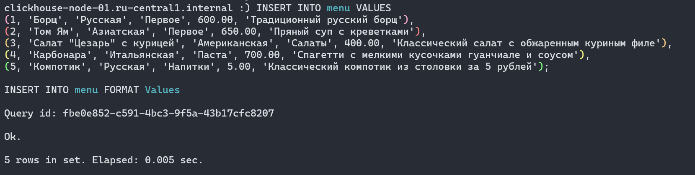

---

Выполним запрос для чтения данных (read):

```sql
SELECT name, price, description FROM menu WHERE cuisine = 'Русская';
```

Запрос выполнился успешно:

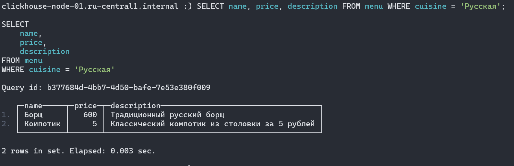

---

Выполним запрос для обновления данных (update):

```sql
ALTER TABLE menu UPDATE price = 500 WHERE name = 'Салат "Цезарь" с курицей';
```

Запрос выполнился успешно:

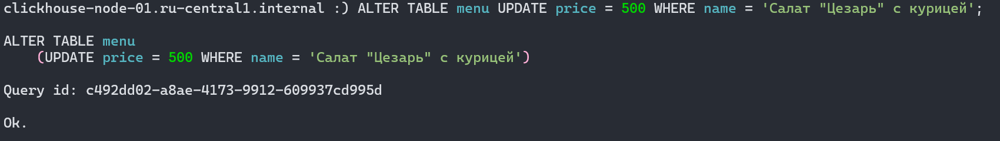

---

Выполним запрос для удаления данных (delete):

```sql
ALTER TABLE menu DELETE WHERE id = 5;
```

Запрос выполнился успешно:

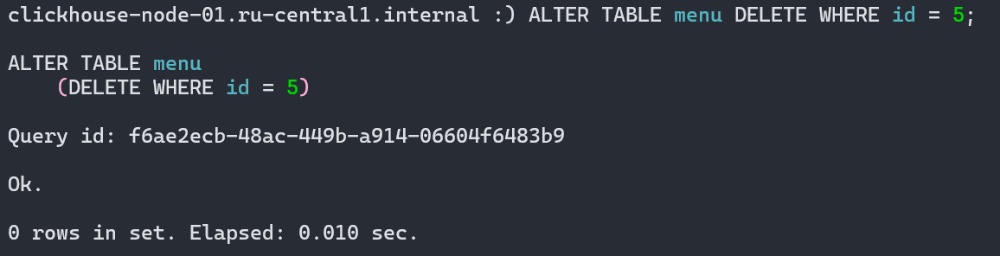

## Добавьте несколько новых полей в таблицу и удалите два-три существующих

Добавим новое поле, выполнив следующий запрос:

```sql
ALTER TABLE menu ADD COLUMN weight UInt16 COMMENT 'Вес блюда';
```

Запрос выполнился успешно, новая колонка заполнена нулями:

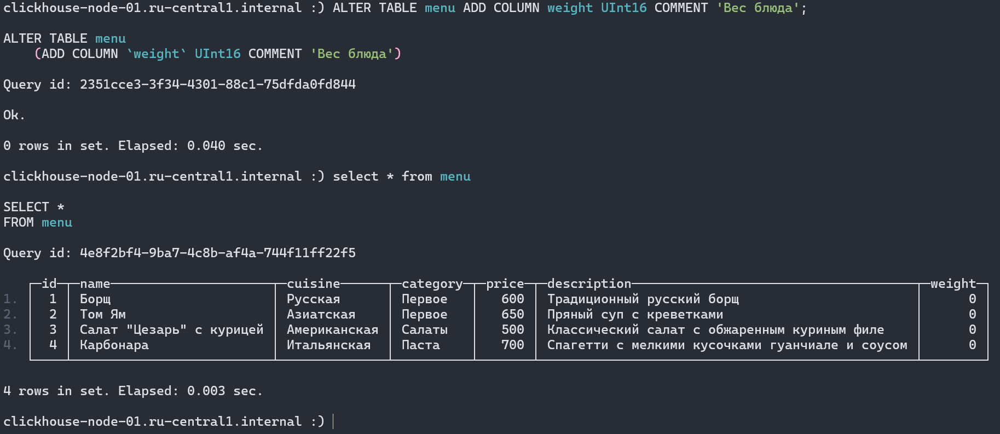

---

Удалим несколько полей, выполнив следующие запросы:

```sql
ALTER TABLE menu DROP COLUMN cuisine;
ALTER TABLE menu DROP COLUMN description;
```

Запросы выполнились успешно:

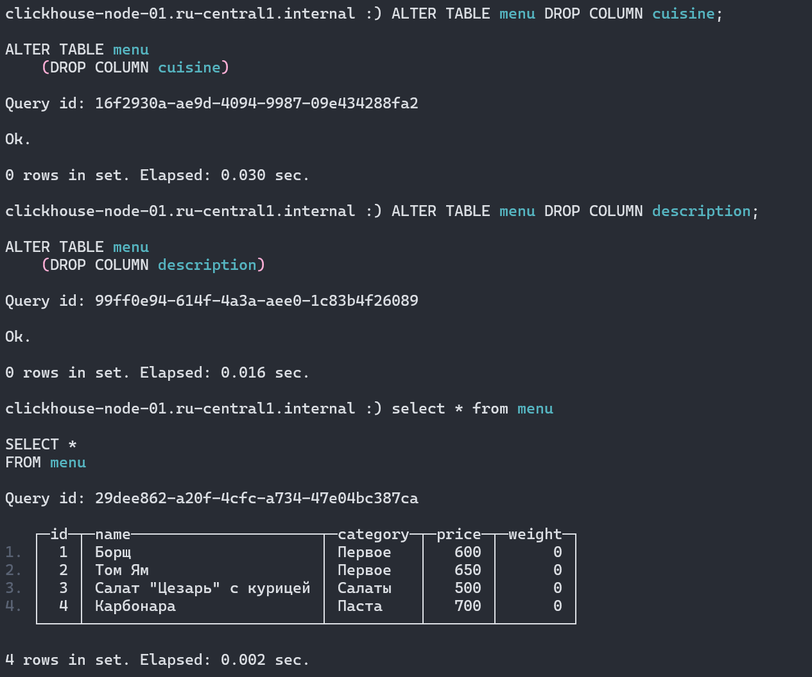

## Выполните выборку данных (select) из любой таблицы из sample dataset

Выполним следующие запросы для создания таблицы и вставки в неё данных из датасета:

```sql
CREATE TABLE dbpedia
(
  id      String,
  title   String,
  text    String,
  vector  Array(Float32) CODEC(NONE)
) ENGINE = MergeTree ORDER BY (id);
```

```bash
seq 0 25 | xargs -P1 -I{} clickhouse client -q "INSERT INTO lesson_5_db.dbpedia SELECT _id, title, text, \"text-embedding-3-large-1536-embedding\" FROM url('https://huggingface.co/api/datasets/Qdrant/dbpedia-entities-openai3-text-embedding-3-large-1536-1M/parquet/default/train/{}.parquet') SETTINGS max_http_get_redirects=5,enable_url_encoding=0;"
```

Выполним запрос для просмотра структуры таблицы:

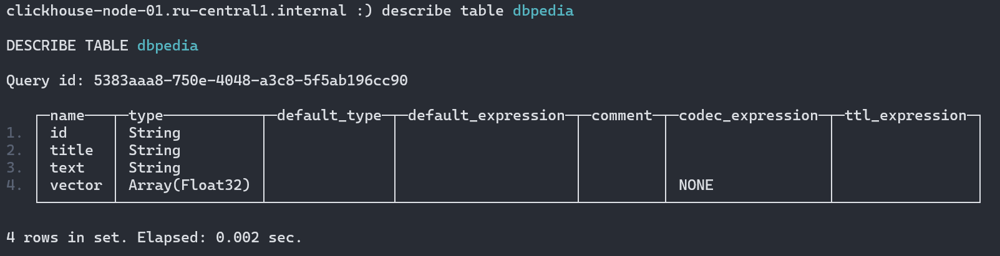

## Материализуйте выбранную таблицу, создав её копию в виде отдельной таблицы

Выполним запрос:

```sql
CREATE MATERIALIZED VIEW dbpedia_mv
ENGINE = MergeTree
ORDER BY id
AS SELECT id, title, text FROM dbpedia
```

## Попрактикуйтесь с партициями: выполните операции ATTACH, DETACH и DROP

Создадим тестовую таблицу с ключом партицирования и наполним её данными:

```sql
CREATE TABLE test_partitioned
(
    id Int32,
    created Date
)
ENGINE = MergeTree
PARTITION BY toYYYYMM(created)
ORDER BY id;

INSERT INTO test_partitioned (id, created) VALUES
(1, '2025-11-01'),
(2, '2025-11-01'),
(3, '2025-10-15');
```

Посмотрим список уникальных значений ключа партицирования:

```sql
SELECT DISTINCT toYYYYMM(created) AS partition FROM test_partitioned;
```

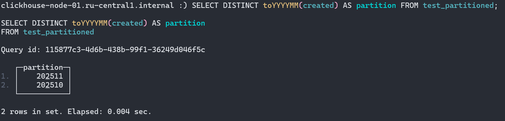

---

Отсоединим одну из партиций:

```sql
ALTER TABLE test_partitioned DETACH PARTITION 202511;
```

Видим что часть данных, относящихся к партиции, пропала из результатов select'а:

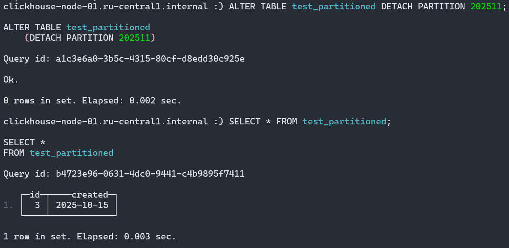

---

Присоединим партицию обратно:

```sql
ALTER TABLE test_partitioned ATTACH PARTITION 202511;
```

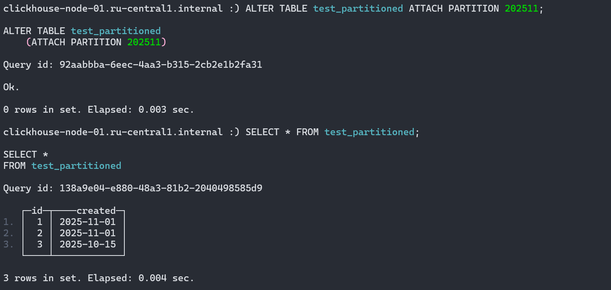

---

Удалим партицию:

```sql
ALTER TABLE test_partitioned DROP PARTITION 202510;
```

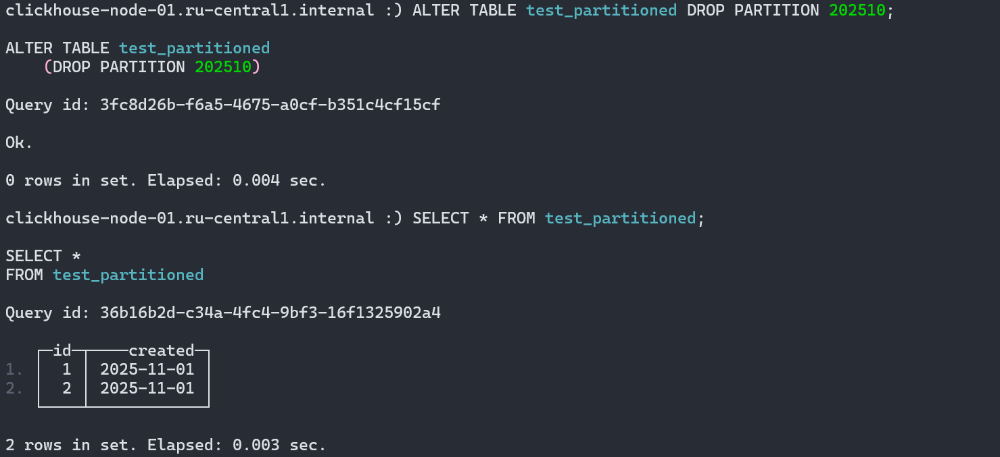
