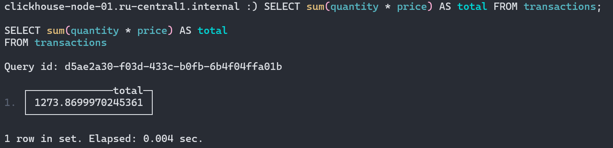
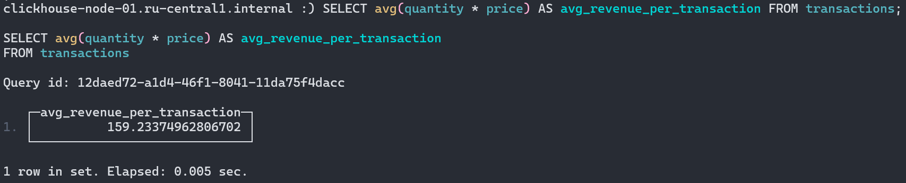
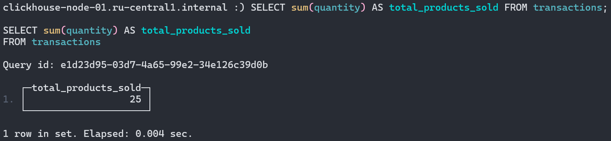
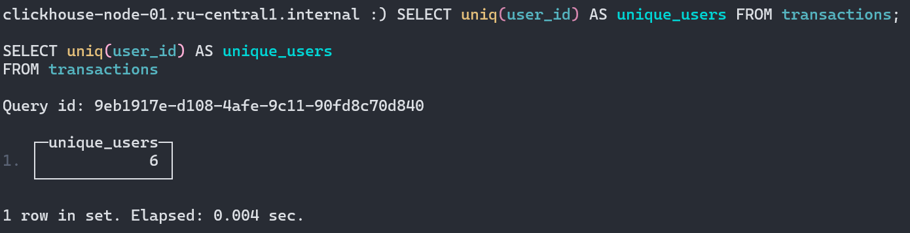
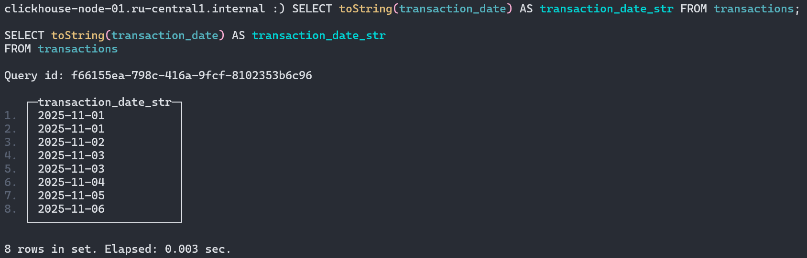
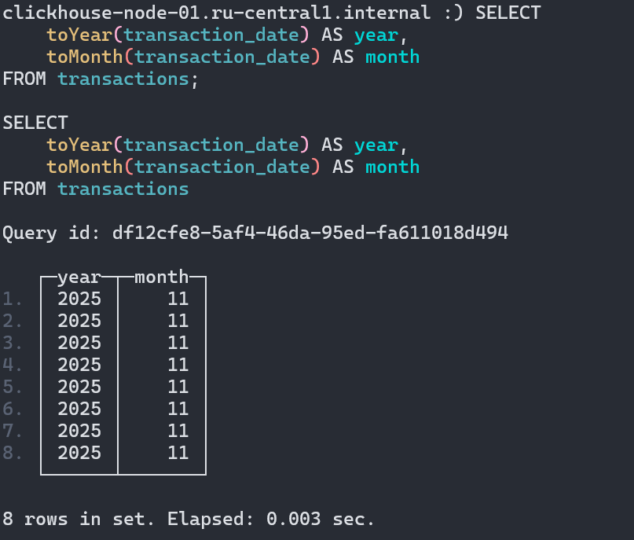
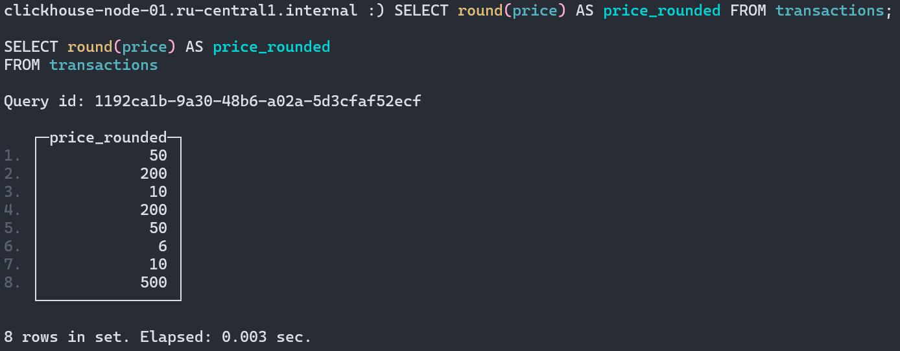
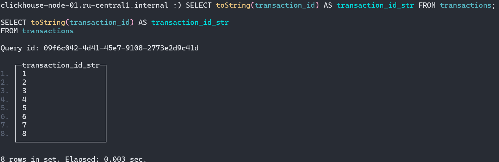
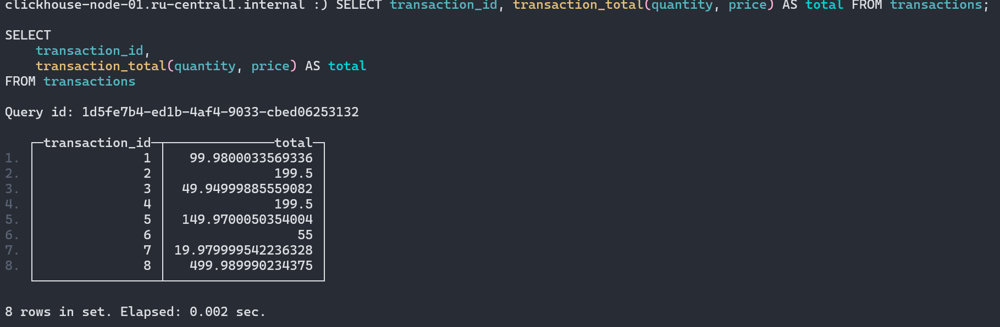
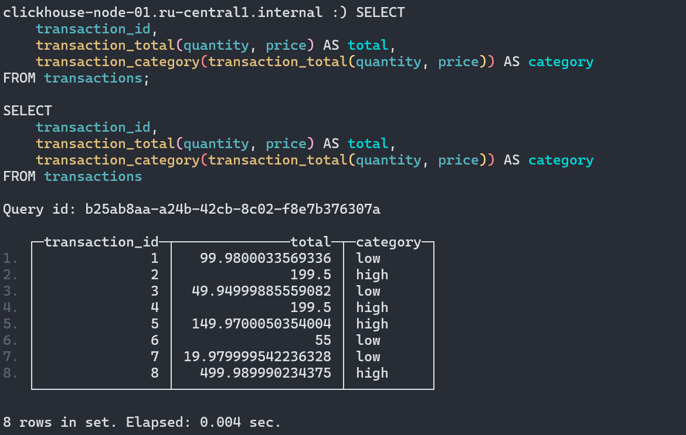

# Домашнее задание

1. Используйте агрегатные функции для обобщения данных.
2. Примените функции, работающие с различными типами данных.
3. Создайте и используйте функции, определяемые пользователем (UDF).

## Создание и наполнение таблицы

```sql
CREATE TABLE transactions
(
    transaction_id UInt32,
    user_id UInt32,
    product_id UInt32,
    quantity UInt8,
    price Float32,
    transaction_date Date
) 
ENGINE = MergeTree()
ORDER BY (transaction_id);

INSERT INTO transactions (transaction_id, user_id, product_id, quantity, price, transaction_date) VALUES
(1, 101, 1001, 2, 49.99, '2025-11-01'),
(2, 102, 1002, 1, 199.50, '2025-11-01'),
(3, 103, 1003, 5, 9.99, '2025-11-02'),
(4, 101, 1002, 1, 199.50, '2025-11-03'),
(5, 104, 1001, 3, 49.99, '2025-11-03'),
(6, 105, 1004, 10, 5.50, '2025-11-04'),
(7, 102, 1003, 2, 9.99, '2025-11-05'),
(8, 106, 1005, 1, 499.99, '2025-11-06');
```

## Агрегатные функции

Общий доход от всех операций:

```sql
SELECT sum(quantity * price) AS total FROM transactions;
```

Результат:



---

Средний доход с одной сделки:

```sql
SELECT avg(quantity * price) AS avg_revenue_per_transaction FROM transactions;
```

Результат:



---

Общее количество проданной продукции:

```sql
SELECT sum(quantity) AS total_products_sold FROM transactions;
```

Результат:



---

Количество уникальных пользователей, совершивших покупку:

```sql
SELECT uniq(user_id) AS unique_users FROM transactions;
```

Результат:



## Функции для работы с типами данных

Преобразование `transaction_date` в строку формата `YYYY-MM-DD`:

```sql
SELECT toString(transaction_date) AS transaction_date_str FROM transactions;
```

Результат:



---

Извлечение года и месяц из `transaction_date`:

```sql
SELECT 
    toYear(transaction_date) AS year,
    toMonth(transaction_date) AS month
FROM transactions;
```

Результат:



---

Округление `price` до ближайшего целого числа:

```sql
SELECT round(price) AS price_rounded FROM transactions;
```

Результат:



---

Преобразование `transaction_id` в строку:

```sql
SELECT toString(transaction_id) AS transaction_id_str FROM transactions;
```

Результат:



## User-Defined Functions (UDFs)

UDF для расчета общей стоимости транзакции:

```sql
CREATE FUNCTION transaction_total AS (quantity, price) -> quantity * price;
```

Использование созданной UDF для расчета общей цены для каждой транзакции:

```sql
SELECT transaction_id, transaction_total(quantity, price) AS total FROM transactions;
```

Результат:



---

UDF для классификации транзакций на "высокоценные" и "малоценные" на основе порогового значения (например, 100):

```sql
CREATE FUNCTION transaction_category AS (total) -> (if(total >= 100, 'high', 'low'));
```

Примените UDF для категоризации каждой транзакции:

```sql
SELECT 
    transaction_id,
    transaction_total(quantity, price) AS total,
    transaction_category(transaction_total(quantity, price)) AS category
FROM transactions;
```

Результат:


