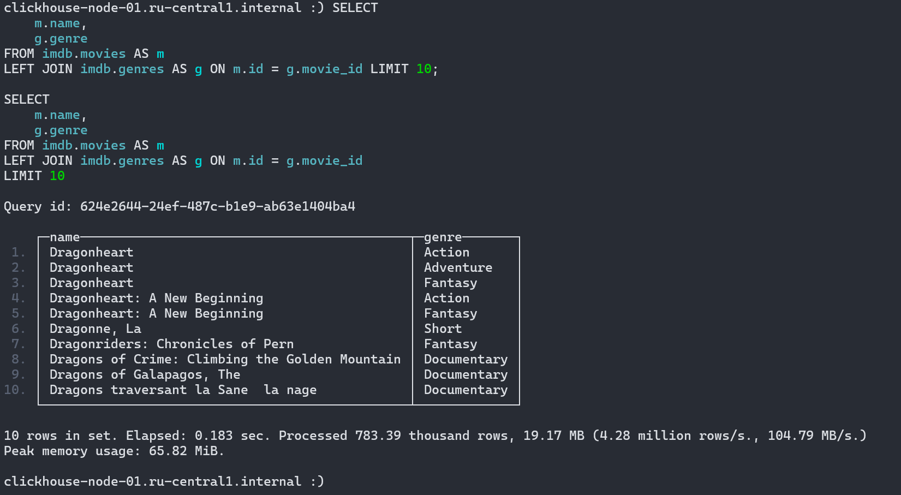
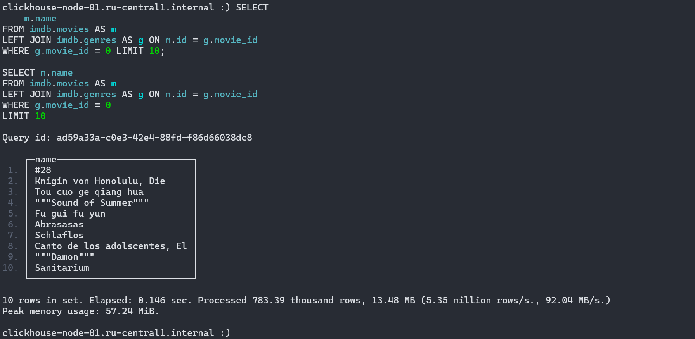
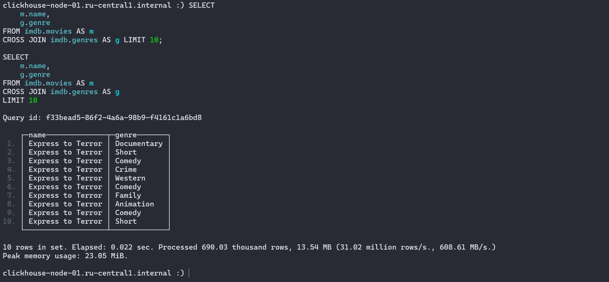
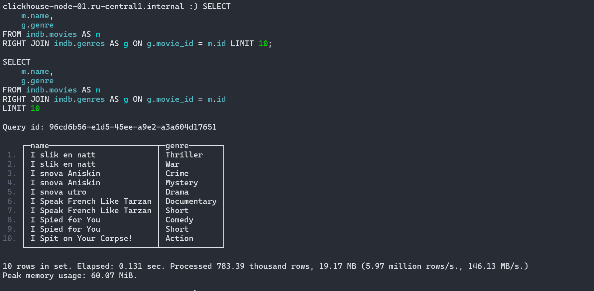
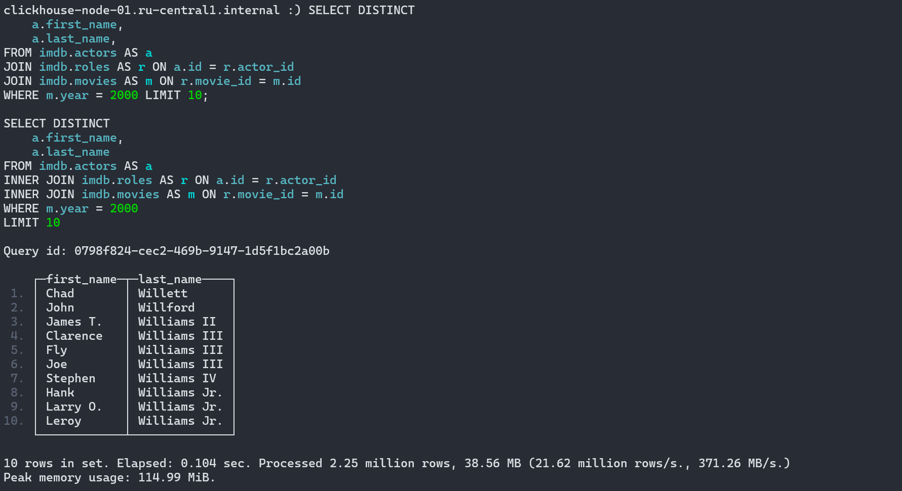
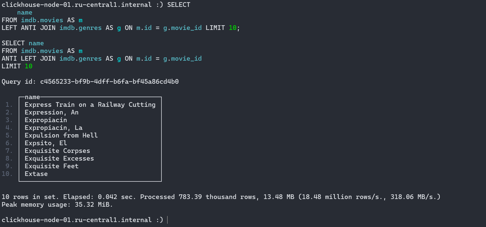

# Домашнее задание

## Создать БД и таблицы

```sql
CREATE DATABASE imdb;

CREATE TABLE imdb.actors
(
    id         UInt32,
    first_name String,
    last_name  String,
    gender     FixedString(1)
) ENGINE = MergeTree ORDER BY (id, first_name, last_name, gender);

CREATE TABLE imdb.genres
(
    movie_id UInt32,
    genre    String
) ENGINE = MergeTree ORDER BY (movie_id, genre);

CREATE TABLE imdb.movies
(
    id   UInt32,
    name String,
    year UInt32,
    rank Float32 DEFAULT 0
) ENGINE = MergeTree ORDER BY (id, name, year);

CREATE TABLE imdb.roles
(
    actor_id   UInt32,
    movie_id   UInt32,
    role       String,
    created_at DateTime DEFAULT now()
) ENGINE = MergeTree ORDER BY (actor_id, movie_id);
```

## Вставить тестовые данные, используя функцию S3

```sql
INSERT INTO imdb.actors
SELECT *
FROM s3('https://datasets-documentation.s3.eu-west-3.amazonaws.com/imdb/imdb_ijs_actors.tsv.gz',
'TSVWithNames');

INSERT INTO imdb.genres
SELECT *
FROM s3('https://datasets-documentation.s3.eu-west-3.amazonaws.com/imdb/imdb_ijs_movies_genres.tsv.gz',
'TSVWithNames');

INSERT INTO imdb.movies
SELECT *
FROM s3('https://datasets-documentation.s3.eu-west-3.amazonaws.com/imdb/imdb_ijs_movies.tsv.gz',
'TSVWithNames');

INSERT INTO imdb.roles(actor_id, movie_id, role)
SELECT actor_id, movie_id, role
FROM s3('https://datasets-documentation.s3.eu-west-3.amazonaws.com/imdb/imdb_ijs_roles.tsv.gz',
'TSVWithNames');
```

## Используя изученные материалы, построить запросы отвечающие на следующие задачи

### Найти жанры для каждого фильма

```sql
SELECT 
    m.name, 
    g.genre
FROM imdb.movies AS m
LEFT JOIN imdb.genres AS g ON m.id = g.movie_id;
```



### Запросить все фильмы, у которых нет жанра

```sql
SELECT 
    m.name
FROM imdb.movies AS m
LEFT JOIN imdb.genres AS g ON m.id = g.movie_id
WHERE g.movie_id = 0;
```



### Объединить каждую строку из таблицы “Фильмы” с каждой строкой из таблицы “Жанры”

```sql
SELECT 
    m.name, 
    g.genre
FROM imdb.movies AS m
CROSS JOIN imdb.genres AS g;
```



### Найти жанры для каждого фильма, НЕ используя INNER JOIN

```sql
SELECT 
    m.name, 
    g.genre
FROM imdb.movies AS m
RIGHT JOIN imdb.genres AS g ON g.movie_id = m.id;
```



### Найти всех актеров и актрис, снявшихся в фильме в N году

```sql
SELECT DISTINCT
    a.first_name, 
    a.last_name,
FROM imdb.actors AS a 
JOIN imdb.roles AS r ON a.id = r.actor_id
JOIN imdb.movies AS m ON r.movie_id = m.id
WHERE m.year = 2000;
```



### Запросить все фильмы, у которых нет жанра, через ANTI JOIN

```sql
SELECT 
    name
FROM imdb.movies AS m
LEFT ANTI JOIN imdb.genres AS g ON m.id = g.movie_id;
```


