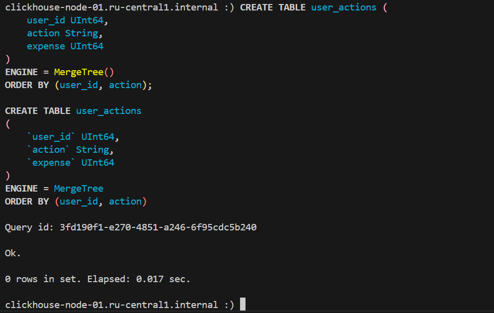
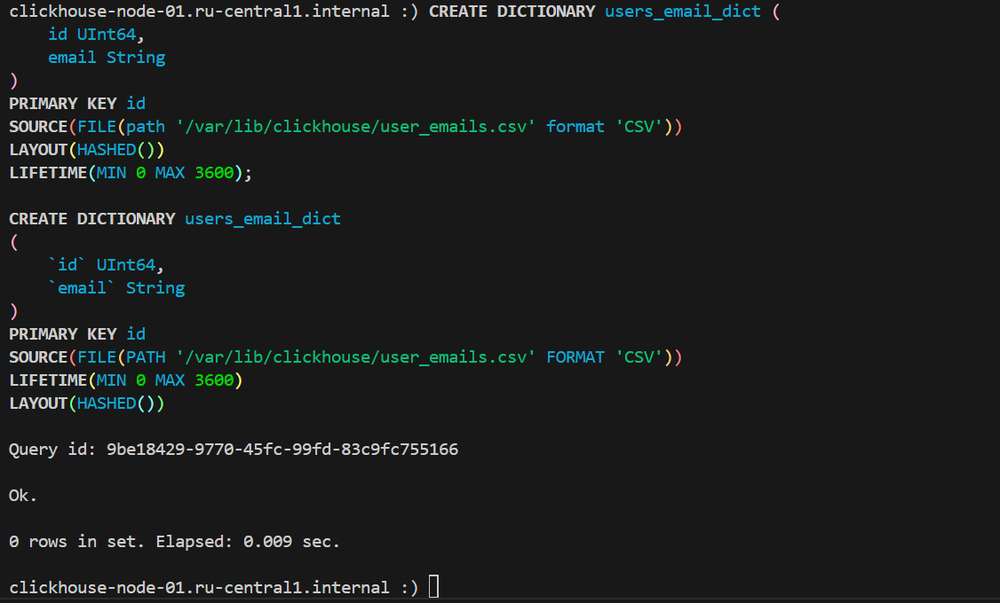
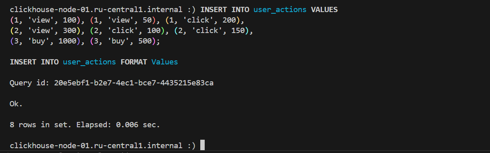
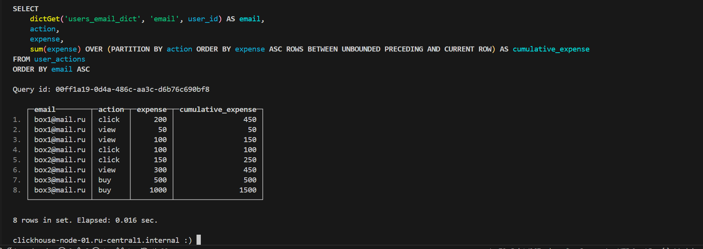

# Домашнее задание

## Создайте таблицу

Необходимо создать таблицу со следующими полями

```sql
user_id UInt64
action String
expense UInt64
```



### Создайте словарь

Необходимо создать словарь, где ключ — user_id, атрибут — email (String), источник словаря выберите любой удобный, например, файл.
Наполните таблицу и источник данными с низкоардинальными значениями для поля action и несколькими повторяющимися строками для каждого user_id.

#### Создадим CSV файл на сервере в директории `/var/lib/clickhouse/user_files/user_emails.csv`

```sh
sudo -u clickhouse vi /var/lib/clickhouse/user_files/user_emails.csv
```

#### Запишем в файл следующие данные и сохраним его

```csv
id,email
1,box1@mail.ru
2,box2@mail.ru
3,box3@mail.ru
```

#### Создадим словарь

```sql
CREATE DICTIONARY users_email_dict (
    id UInt64,
    email String
)
PRIMARY KEY id
SOURCE(FILE(path '/var/lib/clickhouse/user_files/user_emails.csv' format 'CSV'))
LAYOUT(HASHED())
LIFETIME(MIN 0 MAX 3600);
```



### Напишите SELECT запрос

Напишите SELECT, который возвращает:

- email с помощью dictGet
- аккумулятивную сумму expense с окном по action
- сортировку по email

#### Для начала наполним нашу таблицу данными

```sql
INSERT INTO user_actions VALUES 
(1, 'view', 100), (1, 'view', 50), (1, 'click', 200),
(2, 'view', 300), (2, 'click', 100), (2, 'click', 150),
(3, 'buy', 1000), (3, 'buy', 500);
```



#### Выполнение SELECT запроса по условиям задания

```sql
SELECT 
    dictGet('users_email_dict', 'email', user_id) AS email,
    action,
    expense,
    sum(expense) OVER (PARTITION BY action ORDER BY expense ROWS BETWEEN UNBOUNDED PRECEDING AND CURRENT ROW) AS cumulative_expense
    
FROM user_actions
ORDER BY email ASC;
```


