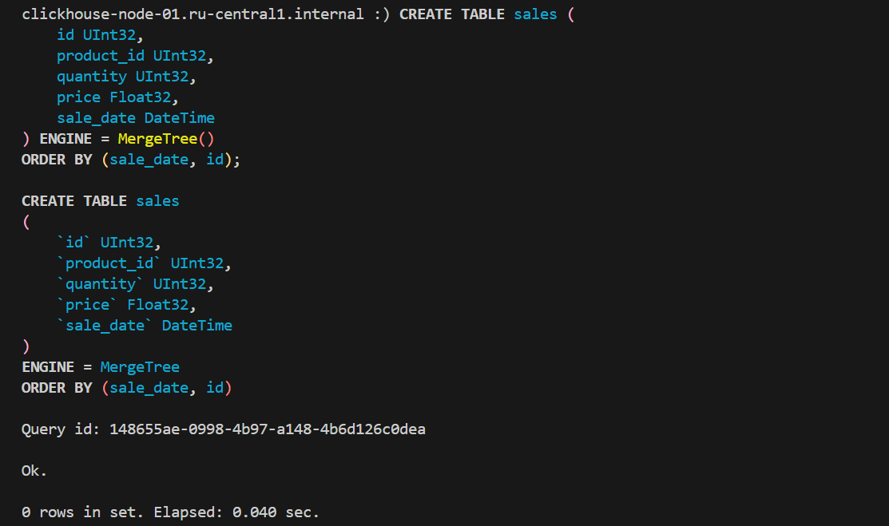
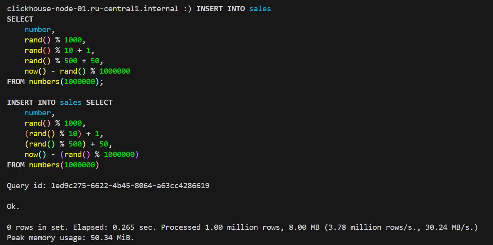
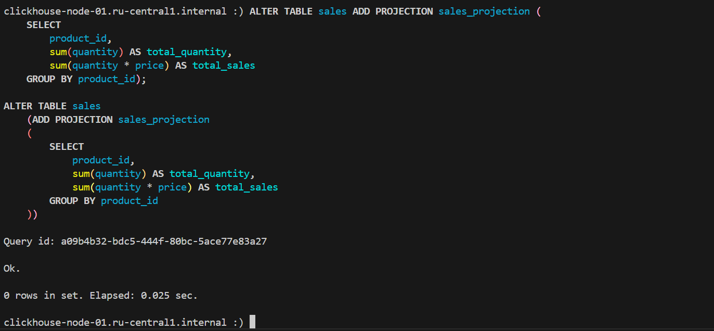
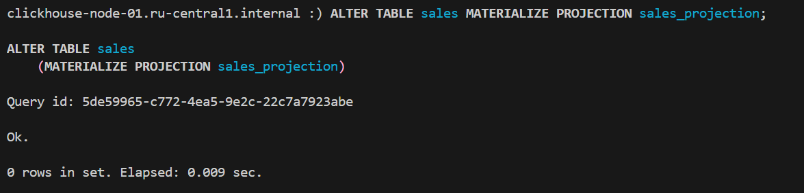
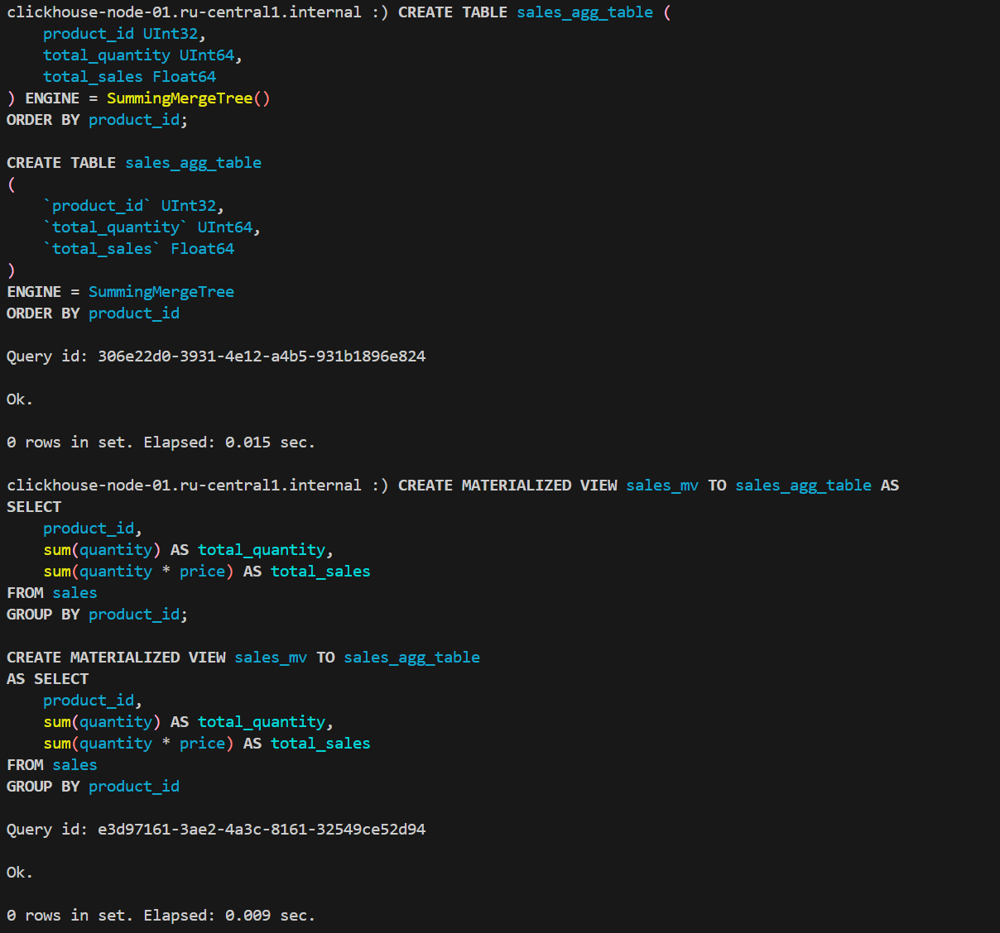
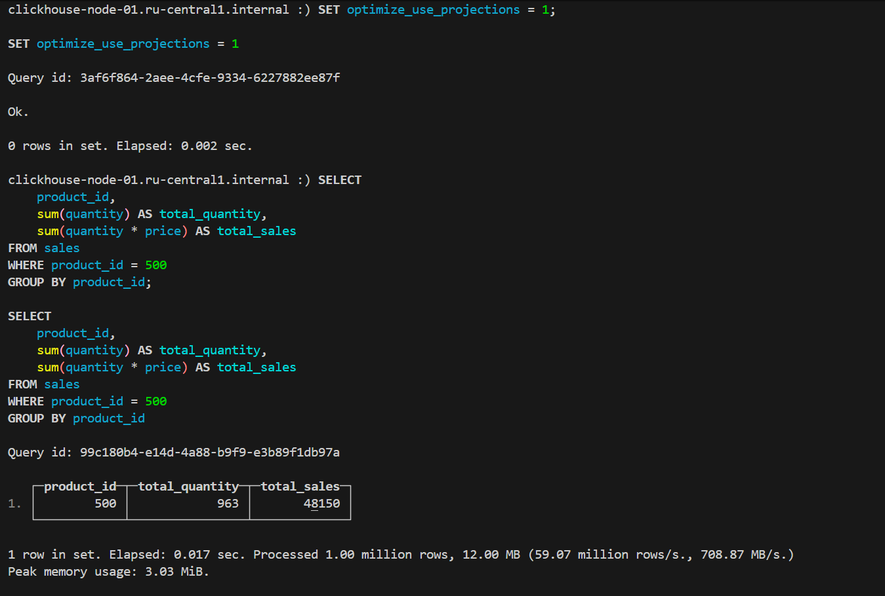
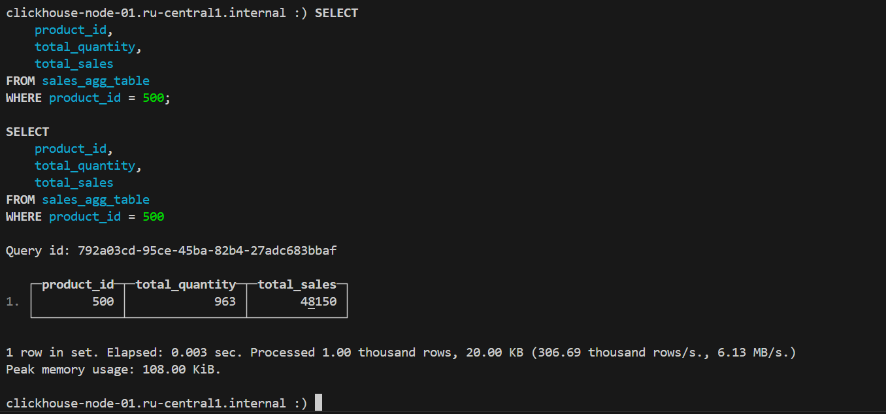
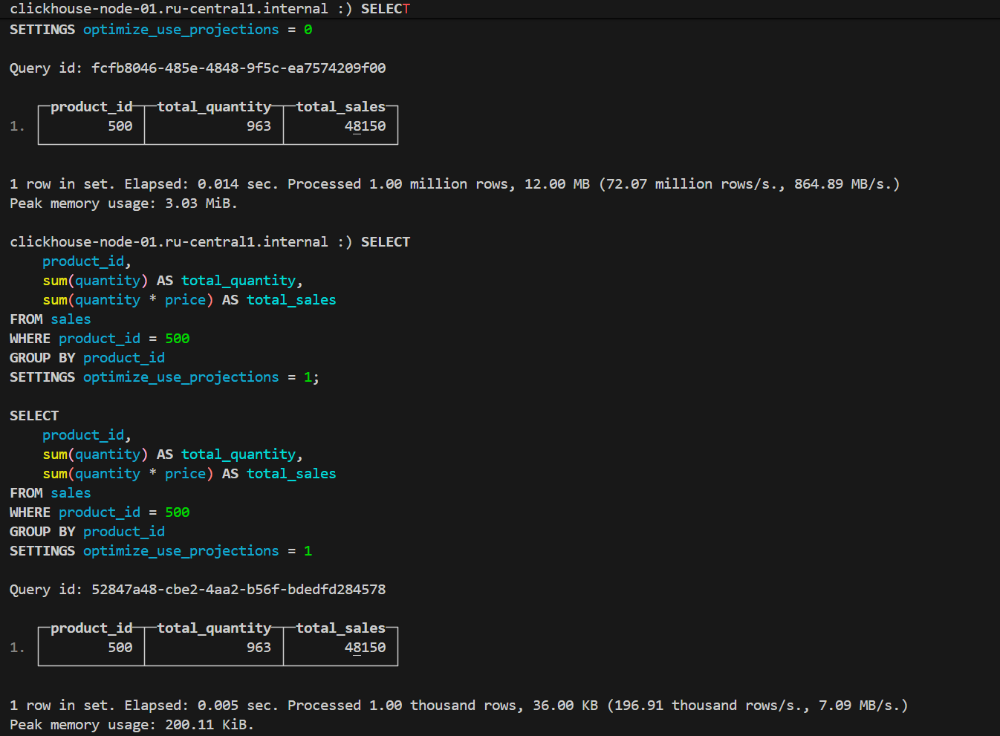
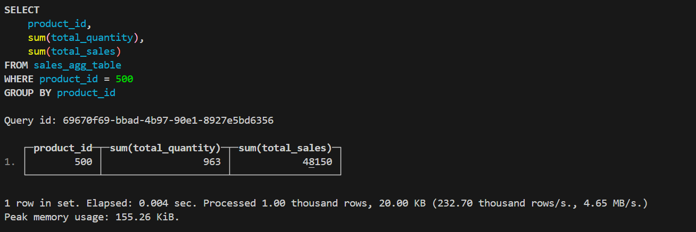

# Домашнее задание

## Создание таблицы

Создайте таблицу sales с полями:

- id (UInt32) — уникальный идентификатор продажи
- product_id (UInt32) — идентификатор продукта
- quantity (UInt32) — количество проданных единиц
- price (Float32) — цена за единицу
- sale_date (DateTime) — дата продажи

```sql
CREATE TABLE sales (
    id UInt32,
    product_id UInt32,
    quantity UInt32,
    price Float32,
    sale_date DateTime
) ENGINE = MergeTree()
ORDER BY (sale_date, id);
```



Заполните таблицу тестовыми данными

```sql
INSERT INTO sales
SELECT
    number,
    rand() % 1000,
    rand() % 10 + 1,
    rand() % 500 + 50,
    now() - rand() % 1000000
FROM numbers(1000000);
```



## Создание проекции

Создайте проекцию для таблицы sales, которая будет агрегировать данные по product_id и считать общую сумму продаж (количество и сумма по цене) за каждый продукт.

```sql
ALTER TABLE sales ADD PROJECTION sales_projection (
    SELECT
        product_id,
        sum(quantity) AS total_quantity,
        sum(quantity * price) AS total_sales
    GROUP BY product_id
);

ALTER TABLE sales MATERIALIZE PROJECTION sales_projection
```




## Создание материализованного представления

Создайте материализованное представление sales_mv, которое будет автоматически обновляться при вставке новых данных в таблицу sales. Оно должно хранить общие продажи по продуктам с полями:

- product_id
- total_quantity
- total_sales

```sql
CREATE TABLE sales_agg_table (
    product_id UInt32,
    total_quantity UInt64,
    total_sales Float64
) ENGINE = SummingMergeTree()
ORDER BY product_id;

CREATE MATERIALIZED VIEW sales_mv TO sales_agg_table AS
SELECT
    product_id,
    sum(quantity) AS total_quantity,
    sum(quantity * price) AS total_sales
FROM sales
GROUP BY product_id;
```



## Запросы к данным

### Напишите запрос, который извлекает данные из проекции sales_projection

```sql
SET optimize_use_projections = 1;

SELECT
    product_id,
    sum(quantity) AS total_quantity,
    sum(quantity * price) AS total_sales
FROM sales
WHERE product_id = 500
GROUP BY product_id;
```



### Напишите запрос, который извлекает данные из материализованного представления sales_mv

Предзаполнение таблицы материализованного представления:

```sql
INSERT INTO sales_agg_table
SELECT
    product_id,
    sum(quantity) AS total_quantity,
    sum(quantity * price) AS total_sales
FROM sales
GROUP BY product_id;
```

```sql
SELECT
    product_id,
    total_quantity,
    total_sales
FROM sales_agg_table
WHERE product_id = 500;
```



## Сравнение производительности

Сравнение производительности на обычной таблице, таблице с включенным использованием проекций и материализованным представлением:

```sql
SELECT
    product_id,
    sum(quantity) AS total_quantity,
    sum(quantity * price) AS total_sales
FROM sales
WHERE product_id = 500
GROUP BY product_id
SETTINGS optimize_use_projections = 0; -- Выключаем использование проекций

SELECT
    product_id,
    sum(quantity) AS total_quantity,
    sum(quantity * price) AS total_sales
FROM sales
WHERE product_id = 500
GROUP BY product_id
SETTINGS optimize_use_projections = 1; -- Включаем использование проекций

SELECT product_id, sum(total_quantity), sum(total_sales)
FROM sales_agg_table
WHERE product_id = 500
GROUP BY product_id;
```





| Обычная таблица | Проекция | Мат. представление |
| --- | --- | --- |
| Elapsed: 0.014 sec. Processed 1.00 million rows, 12.00 MB (72.07 million rows/s., 864.89 MB/s.) Peak memory usage: 3.03 MiB. | Elapsed: 0.005 sec. Processed 1.00 thousand rows, 36.00 KB (196.91 thousand rows/s., 7.09 MB/s.) Peak memory usage: 200.11 KiB. | Elapsed: 0.004 sec. Processed 1.00 thousand rows, 20.00 KB (232.70 thousand rows/s., 4.65 MB/s.) Peak memory usage: 155.26 KiB. |
