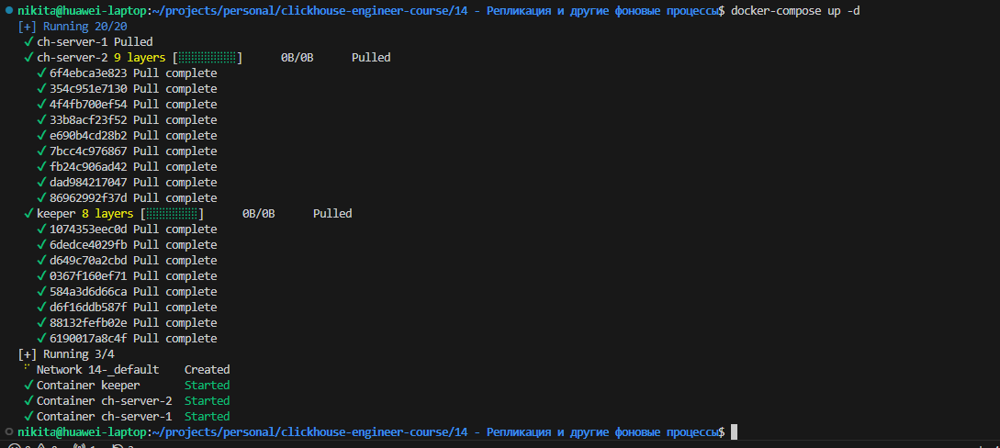
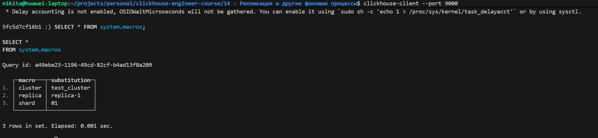
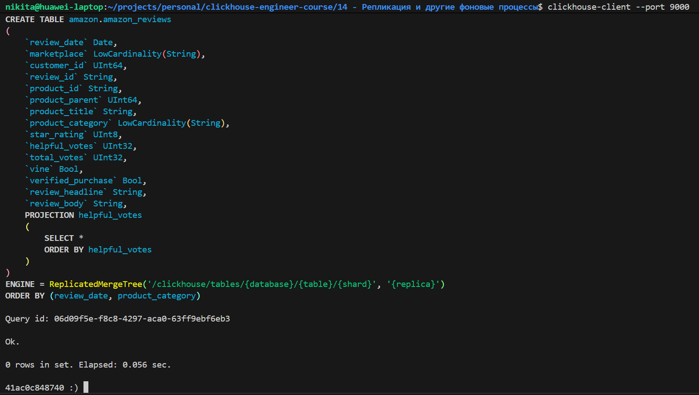
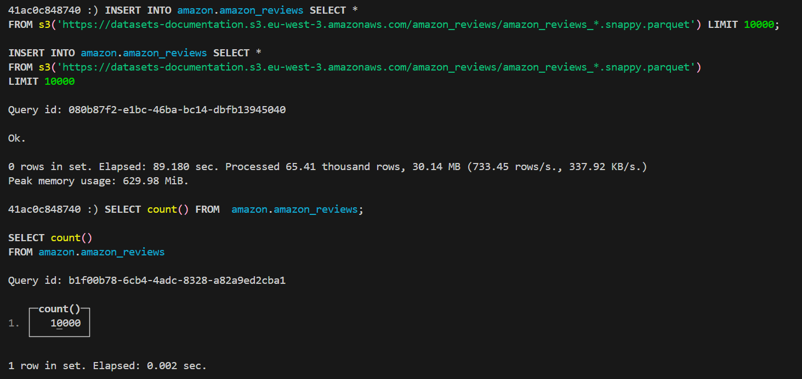
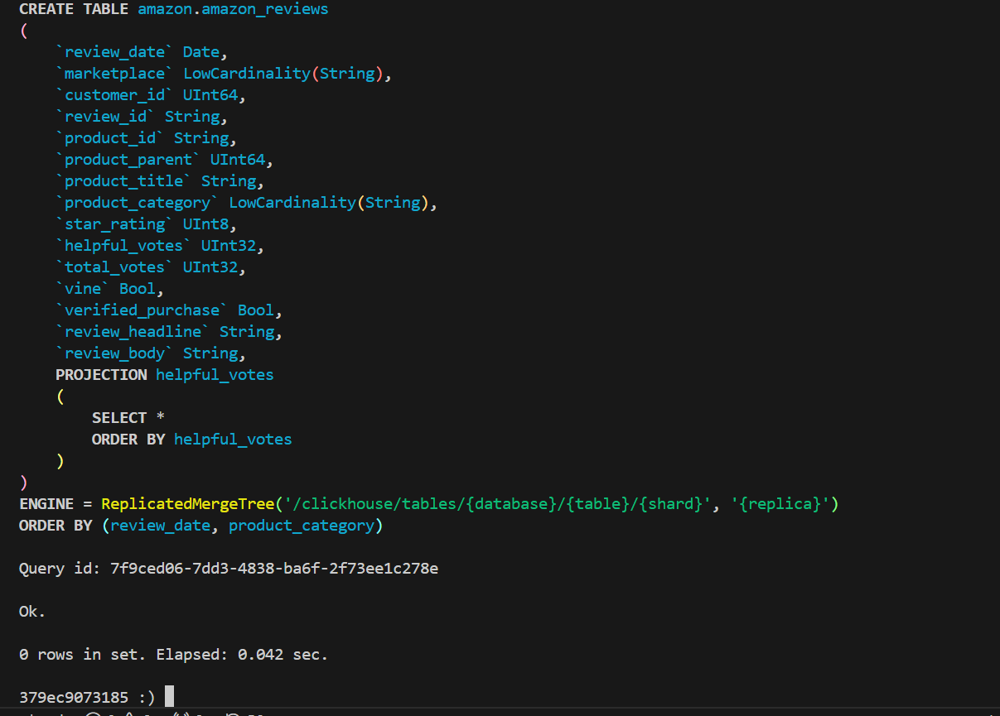
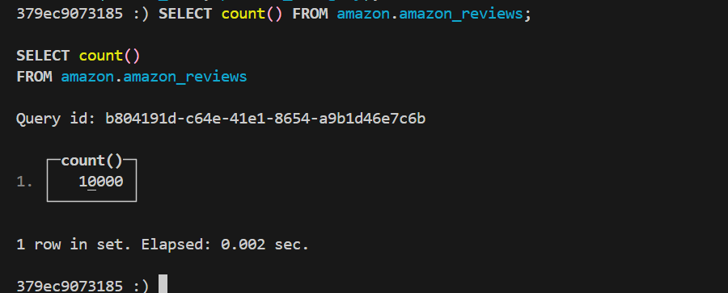
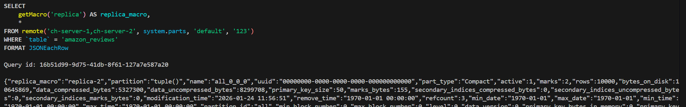
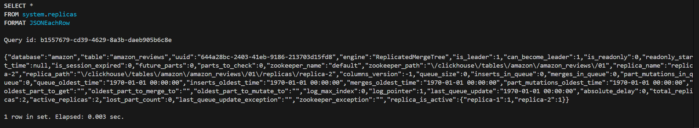
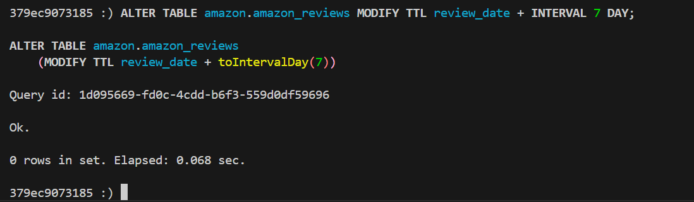
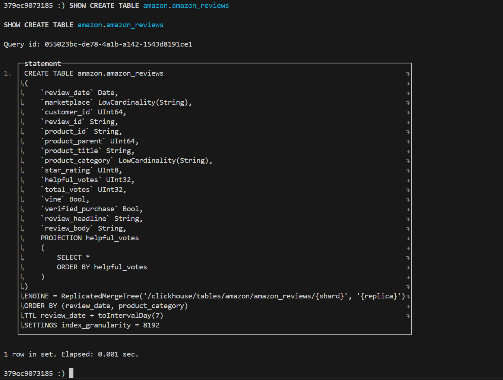

# Домашнее задание

## Подготовка инсталляции

Для поднятия нескольких отдельных узлов ClickHouse воспользуемся Docker контейнерами. Будем использовать следующий `docker-compose.yml` файл:

```yml
version: '3.8'

services:
  keeper:
    image: clickhouse/clickhouse-keeper:latest
    container_name: keeper
    ports:
      - "9181:9181"
    volumes:
      - ./keeper_server_config.xml:/etc/clickhouse-keeper/keeper_config.xml:ro

  ch-server-1:
    image: clickhouse/clickhouse-server:latest
    container_name: ch-server-1
    depends_on:
      - keeper
    ports:
      - "8123:8123"
      - "9000:9000"
    environment:
      - CLICKHOUSE_PASSWORD=123
    volumes:
      - ./keeper_client_config.xml:/etc/clickhouse-server/config.d/zookeeper.xml:ro
      - ./macros_server_1.xml:/etc/clickhouse-server/config.d/macros.xml:ro

  ch-server-2:
    image: clickhouse/clickhouse-server:latest
    container_name: ch-server-2
    depends_on:
      - keeper
    ports:
      - "8124:8123"
      - "9001:9000"
    environment:
      - CLICKHOUSE_PASSWORD=123
    volumes:
      - ./keeper_client_config.xml:/etc/clickhouse-server/config.d/zookeeper.xml:ro
      - ./macros_server_2.xml:/etc/clickhouse-server/config.d/macros.xml:ro
```

Определим настройки подключения к ClickHouse Keeper для синхронизации репликации между узлами. Сохраним конфигурацию в файл `keeper_client_config.xml`:

```xml
<clickhouse>
    <zookeeper>
        <node>
            <host>keeper</host>
            <port>9181</port>
        </node>
    </zookeeper>
</clickhouse>
```

Определим конфигурацию ClickHouse Keeper и сохраним её в файл `keeper_server_config.xml`:

```xml
<clickhouse>
    <listen_host>0.0.0.0</listen_host>
    <logger>
        <level>information</level>
        <console>1</console>
    </logger>

    <keeper_server>
        <tcp_port>9181</tcp_port>
        <server_id>1</server_id>
        <log_storage_path>/var/lib/clickhouse-keeper/coordination/log</log_storage_path>
        <snapshot_storage_path>/var/lib/clickhouse-keeper/coordination/snapshots</snapshot_storage_path>

        <coordination_settings>
            <operation_timeout_ms>10000</operation_timeout_ms>
            <session_timeout_ms>30000</session_timeout_ms>
            <raft_logs_level>information</raft_logs_level>
        </coordination_settings>

        <raft_configuration>
            <server>
                <id>1</id>
                <hostname>keeper</hostname>
                <port>9234</port>
            </server>
        </raft_configuration>
    </keeper_server>
</clickhouse>
```

Выполним запуск набора контейнеров следующей командой:

```sh
docker-compose up -d
```



Подключимся к одному из узлов ClickHouse:

```sh
clickhouse-client --port 9000
```

## Загрузите любой демонстрационный DATASET

Возьмём датасет [Amazon Customer Review](https://clickhouse.com/docs/getting-started/example-datasets/amazon-reviews)

Подготовим таблицу, изменив движок на ReplicatedMergeTree:

```sql
CREATE DATABASE amazon

CREATE TABLE amazon.amazon_reviews
(
    `review_date` Date,
    `marketplace` LowCardinality(String),
    `customer_id` UInt64,
    `review_id` String,
    `product_id` String,
    `product_parent` UInt64,
    `product_title` String,
    `product_category` LowCardinality(String),
    `star_rating` UInt8,
    `helpful_votes` UInt32,
    `total_votes` UInt32,
    `vine` Bool,
    `verified_purchase` Bool,
    `review_headline` String,
    `review_body` String,
    PROJECTION helpful_votes
    (
        SELECT *
        ORDER BY helpful_votes
    )
)
ENGINE = ReplicatedMergeTree('/clickhouse/tables/{database}/{table}/{shard}', '{replica}')
ORDER BY (review_date, product_category)
```

Перед созданием таблицы, можно убедиться что макросы считались корректно из файлов `macros_server_1.xml` и `macros_server_2.xml`. Для каждого из узлов, значение макроса replica на нём должно иметь отличающийся вид.

```sql
SELECT * FROM system.macros;
```



Создание таблицы:



Наполним таблицу данными:

```sql
INSERT INTO amazon.amazon_reviews SELECT *
FROM s3('https://datasets-documentation.s3.eu-west-3.amazonaws.com/amazon_reviews/amazon_reviews_*.snappy.parquet') LIMIT 10000
```



## Добавление реплик

Подключимся на второй узел ClickHouse:

```sh
clickhouse-client --port 9001
```

Создадим аналогичную таблицу:



Видим что таблица автоматически заполнилась данными из первой реплики:



## Выполнение запросов и сохранение результатов

Запрос 1 (собираем данные о кусках таблиц с обеих нод):

```sql
SELECT
    getMacro('replica') AS replica_macro,
    *
FROM remote('ch-server-1,ch-server-2', system.parts, 'default', '123')
WHERE table = 'amazon_reviews'
FORMAT JSONEachRow;
```



Результаты: [query_1.ndjson](./query_1.ndjson)

Запрос 2 (проверяем статус здоровья репликации):

```sql
SELECT * FROM system.replicas FORMAT JSONEachRow;
```



Результаты: [query_2.ndjson](./query_2.ndjson)

## Добавление TTL на таблицу

Для добавления TTL на таблицу выполним запрос на любом узле:

```sql
ALTER TABLE amazon.amazon_reviews MODIFY TTL review_date + INTERVAL 7 DAY;
```



В результате таблица будет иметь следующее определение:


