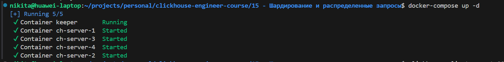
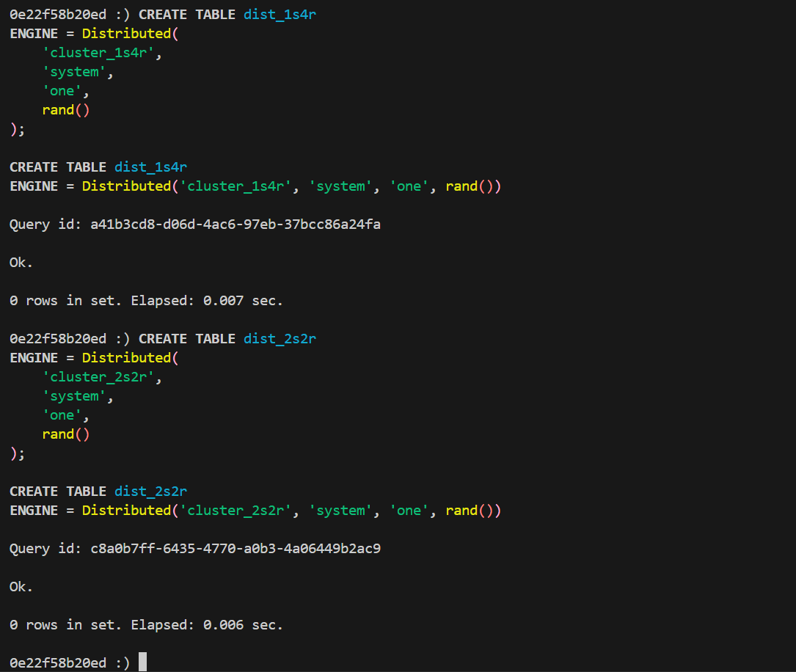
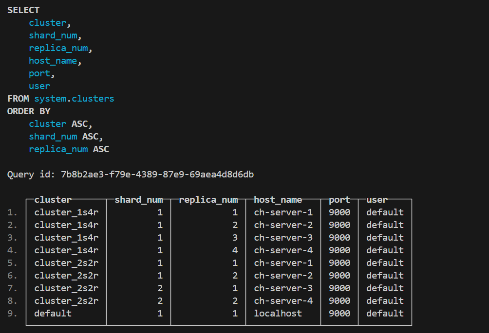
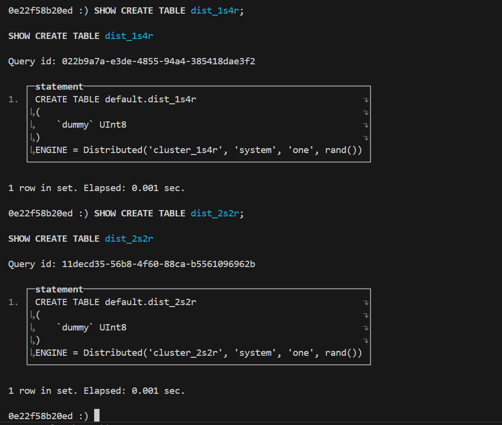

# Домашнее задание

## Подготовка инсталляции

Для подготовки кластера будем использовать видоизмененные конфигурационные файлы из урока [14 - Репликация и другие фоновые процессы](../14%20-%20Репликация%20и%20другие%20фоновые%20процессы/README.md).

## Опишите две или более топологий объединения экземпляров в шарды, указав фактор репликации и количество шардов

Определим две разных топологии кластера:

- 1 шард и 4 реплики - cluster_1s4r
- 2 шарда и 2 реплики - cluster_2s2r

Запустим сервисы определенные в [`docker-compose.yml`](./docker-compose.yml):

```sh
docker-compose up -d
```



## Создание DISTRIBUTED-таблицы на каждую из топологий

Подключимся к первому узлу и создадим на нём distributed таблицы под топологии cluster_1s4r и cluster_2s2r:

```sql
CREATE TABLE dist_1s4r
ENGINE = Distributed(
    'cluster_1s4r',
    'system',
    'one',
    rand()
);

CREATE TABLE dist_2s2r
ENGINE = Distributed(
    'cluster_2s2r',
    'system',
    'one',
    rand()
);
```



## Проверка конфигурации

Информация по кластерам:

```sql
SELECT 
    cluster, 
    shard_num, 
    replica_num, 
    host_name, 
    port, 
    user
FROM system.clusters
ORDER BY cluster, shard_num, replica_num;
```



Определения таблиц:

```sql
SHOW CREATE TABLE dist_1s4r;
SHOW CREATE TABLE dist_2s2r;
```


