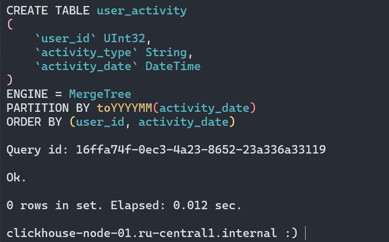
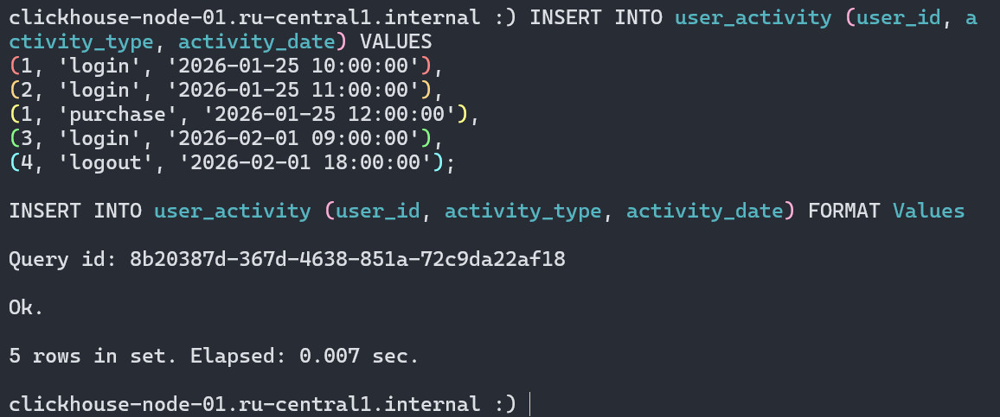
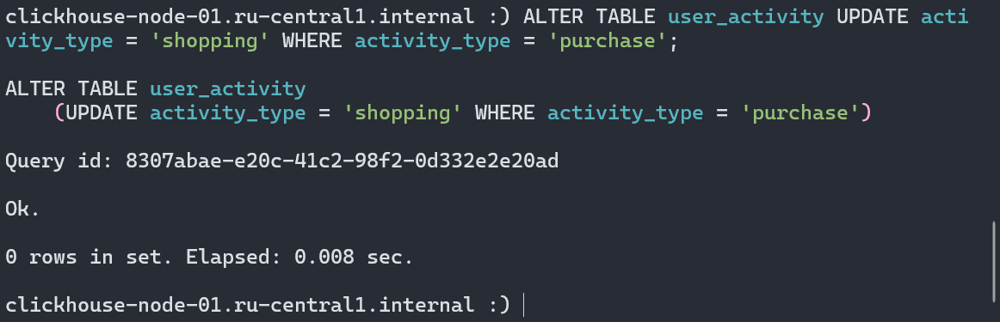
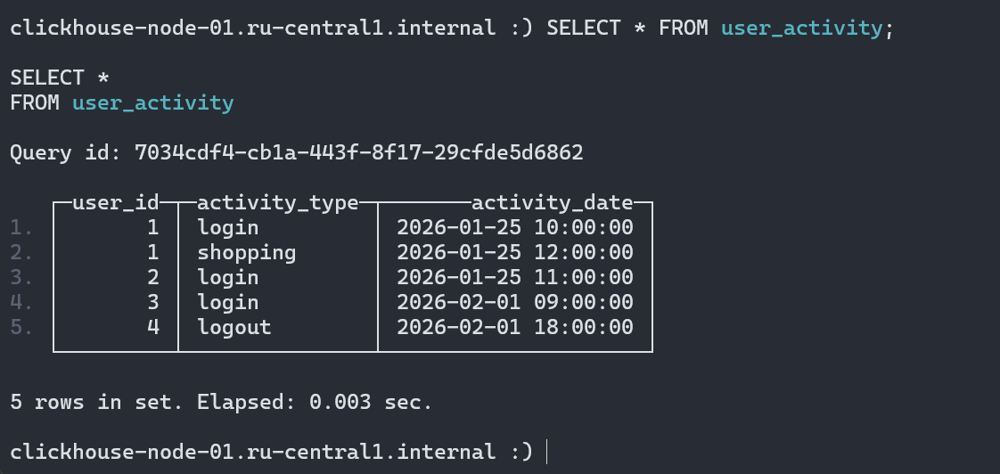
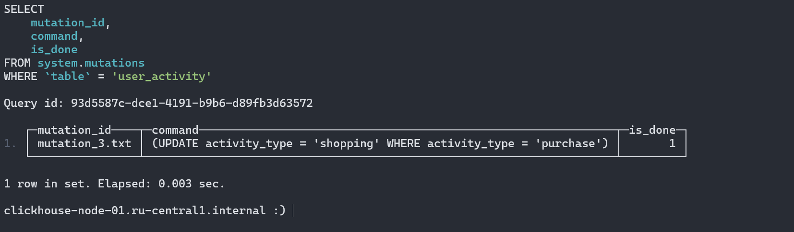
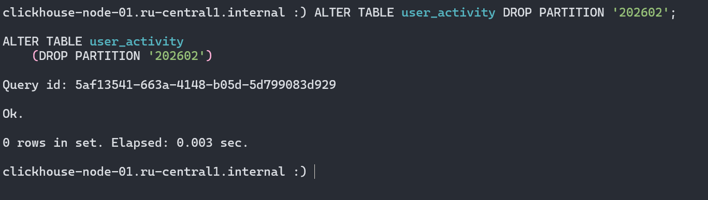
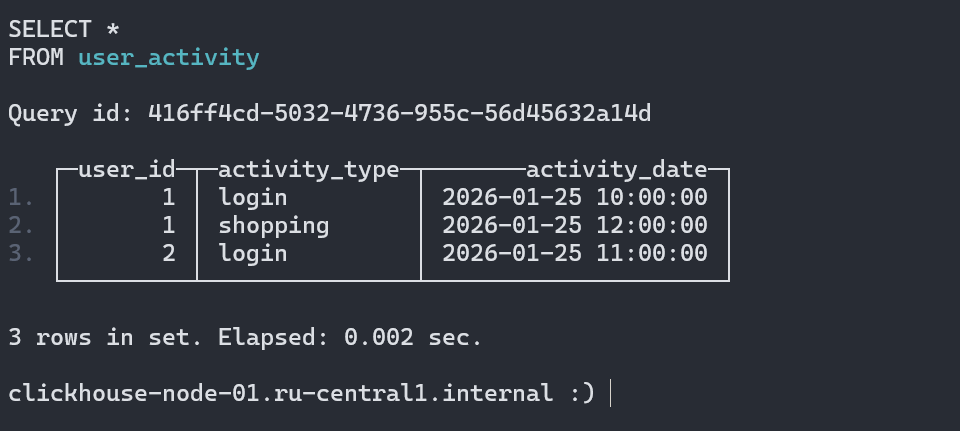
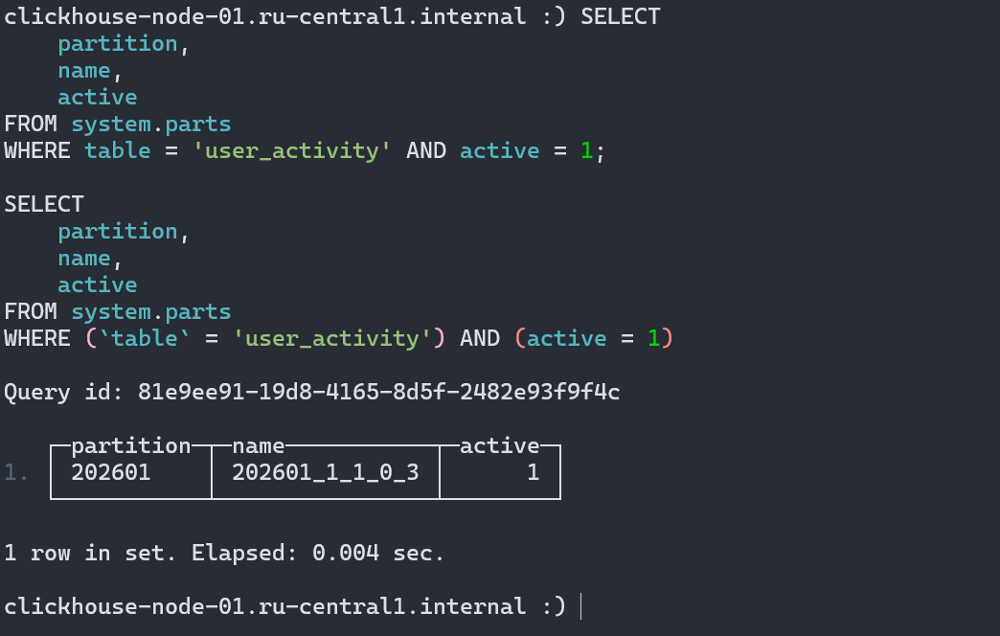

# Домашнее задание

## Создание таблицы

Выполним следующий запрос:

```sql
CREATE TABLE user_activity (
    user_id UInt32,
    activity_type String,
    activity_date DateTime
) 
ENGINE = MergeTree()
PARTITION BY toYYYYMM(activity_date)
ORDER BY (user_id, activity_date);
```



## Заполнение таблицы

Вставим данные за разные месяцы, чтобы они попали в разные партиции:

```sql
INSERT INTO user_activity (user_id, activity_type, activity_date) VALUES
(1, 'login', '2026-01-25 10:00:00'),
(2, 'login', '2026-01-25 11:00:00'),
(1, 'purchase', '2026-01-25 12:00:00'),
(3, 'login', '2026-02-01 09:00:00'),
(4, 'logout', '2026-02-01 18:00:00');
```



## Выполнение мутаций

Изменим значения колонки `activity_type` для некоторых строк:

```sql
ALTER TABLE user_activity UPDATE activity_type = 'shopping' WHERE activity_type = 'purchase';
```



## Проверка результатов

Чтобы убедиться, что мутация завершена, проверим записи в исходной и системной таблице `system.mutations`:

```sql
SELECT * FROM user_activity;
```



```sql
SELECT 
    mutation_id, 
    command, 
    is_done 
FROM system.mutations 
WHERE table = 'user_activity';
```



## Манипуляции с партициями

Удалим одну из партиций:

```sql
ALTER TABLE user_activity DROP PARTITION '202602';
```



## Проверка состояния таблицы

Проверим записи в исходной таблице:

```sql
SELECT * FROM user_activity;
```



Как видим остались лишь данные за первый месяц.

Также можем проверить список партиций и активных партов в таблице `system.parts`:

```sql
SELECT 
    partition, 
    name, 
    active 
FROM system.parts 
WHERE table = 'user_activity' AND active = 1;
```


