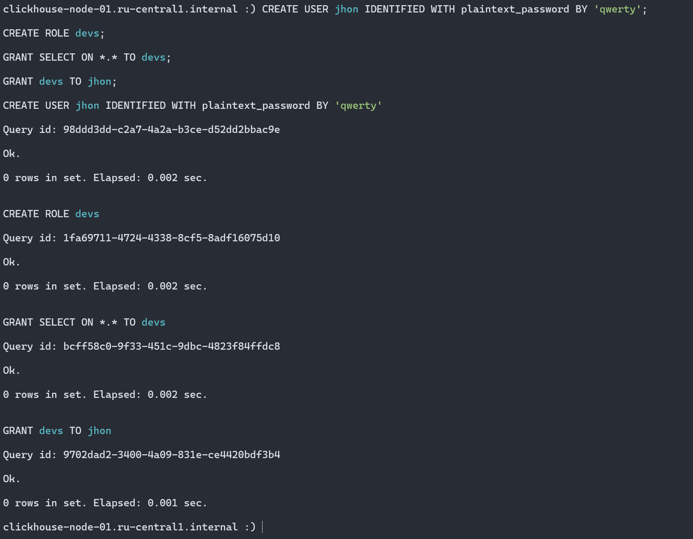
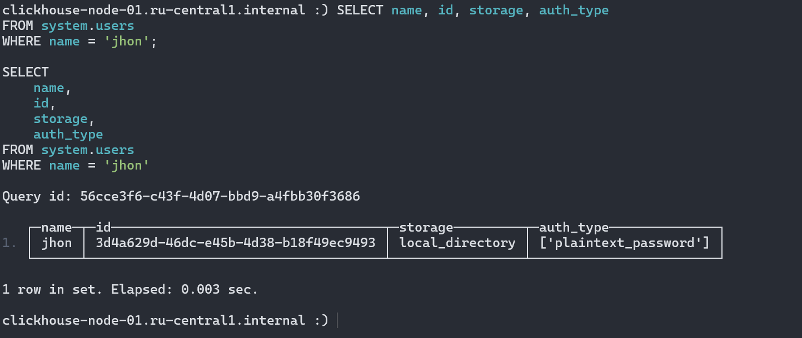
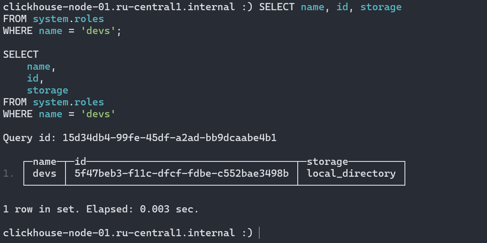
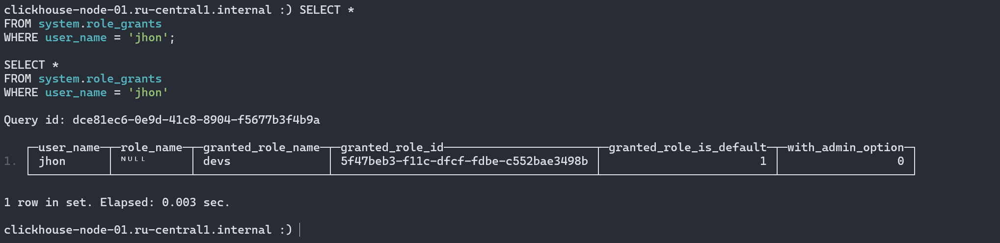

# Домашнее задание

## Подготовка сущностей

Выполним следующие команды по созданию пользователя и роли, а также их связыванию:

```sql
CREATE USER jhon IDENTIFIED WITH plaintext_password BY 'qwerty';

CREATE ROLE devs;

GRANT SELECT ON *.* TO devs;

GRANT devs TO jhon;
```



## Проверка результатов

Убедимся, что пользователь `jhon` существует и активен:

```sql
SELECT name, id, storage, auth_type 
FROM system.users 
WHERE name = 'jhon';
```



Проверим, что роль `devs` существует:

```sql
SELECT name, id, storage 
FROM system.roles 
WHERE name = 'devs';
```



Проверим связи между пользователем и ролью:

```sql
SELECT *
FROM system.role_grants 
WHERE user_name = 'jhon';
```



Проверим разрешения роли devs:

```sql
SELECT * FROM system.grants WHERE role_name = 'devs';
```


