# Домашнее задание

## Разверните S3 с использованием Object Storage от Yandex Cloud

### Создание сервисного аккаунта

Перейдем в раздел **Identity and Access Management** > **Сервисные аккаунты**:

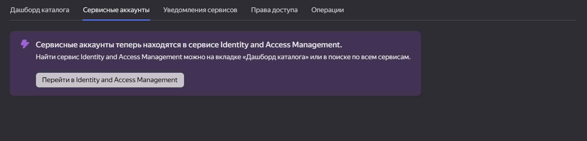

Создадим новый сервисный аккаунт:

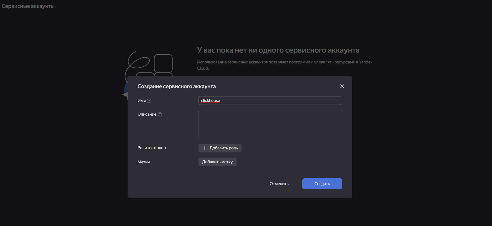

Перейдем на странницу созданного аккаунта и создадим новый статический ключ:

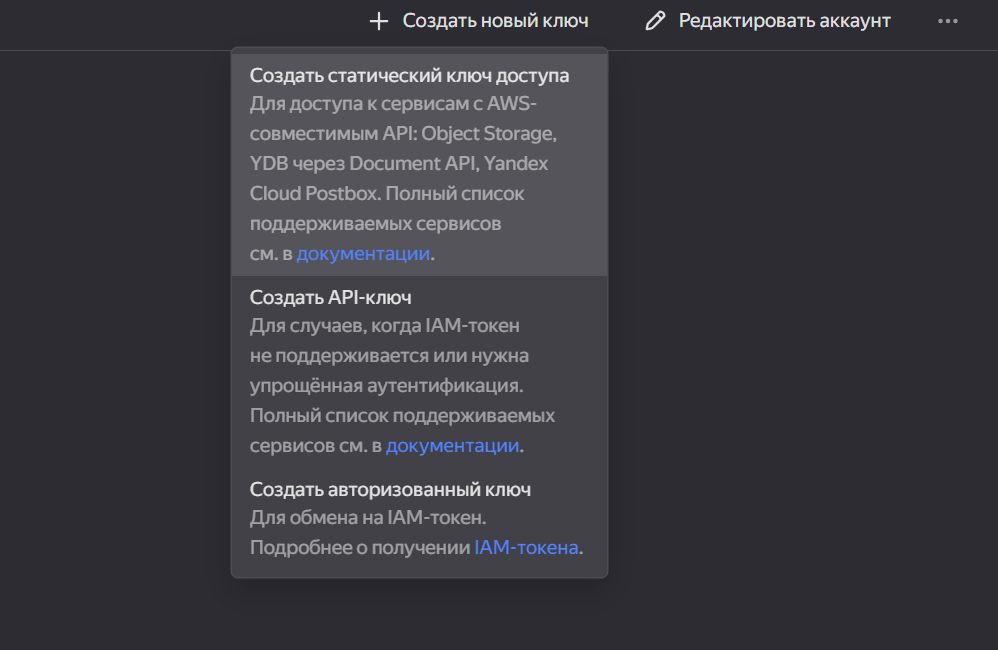

Скопируем сам ключ и его идентификатор.

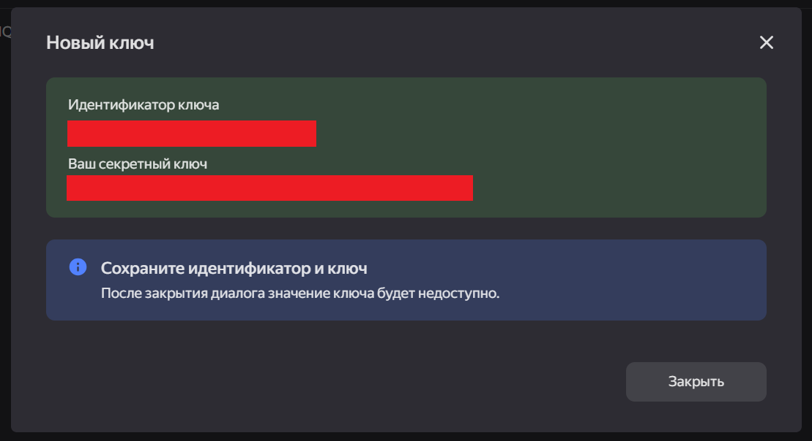

### Создание бакета

Теперь перейдем на страницу **Object Storage** / **Бакеты**:

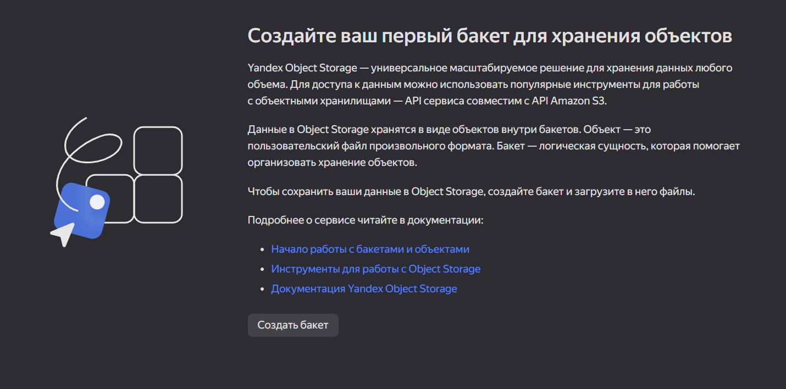

Заполним поля и создадим нажмём **Создать бакет**:

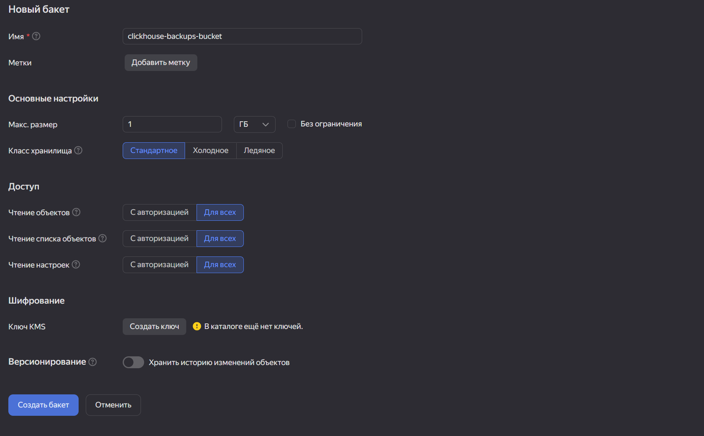

После создания выдадим доступ созданному ранее сервисному аккаунту на бакет:

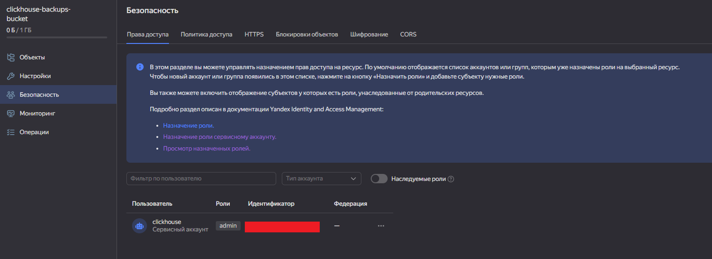

## Установка clickhouse-backup

Выполним скачивание и установку утилиты `clickhouse-backup` при помощи следующих команд:

```sh
wget https://github.com/Altinity/clickhouse-backup/releases/download/v2.6.40/clickhouse-backup-linux-amd64.tar.gz
tar -xf clickhouse-backup-linux-amd64.tar.gz
sudo install -o root -g root -m 0755 build/linux/amd64/clickhouse-backup /usr/local/bin
```

Проверим про установка утилиты прошла успешно:

```sh
/usr/local/bin/clickhouse-backup -v
```

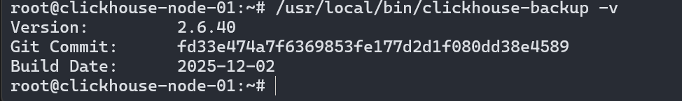

## Настройка политики хранения clickhouse-backup

Создадим файл `/etc/clickhouse-server/config.d/storage_config.xml` и заполним его следующим содержимым:

```xml
<clickhouse>
  <storage_configuration>
    <disks>
      <s3_disk>
        <type>s3</type>
        <endpoint>https://storage.yandexcloud.net/clickhouse-backups-bucket</endpoint>
        <access_key_id>...</access_key_id>
        <secret_access_key>...</secret_access_key>
        <metadata_path>/var/lib/clickhouse/disks/s3_disk/</metadata_path>
      </s3_disk>
      <s3_cache>
        <type>cache</type>
        <disk>s3_disk</disk>
        <path>/var/lib/clickhouse/disks/s3_cache/</path>
        <max_size>10Gi</max_size>
      </s3_cache>
    </disks>
    <policies>
      <s3_main>
        <volumes>
          <main>
            <disk>s3_disk</disk>
          </main>
        </volumes>
      </s3_main>
    </policies>
  </storage_configuration>
</clickhouse>
```

Параметры `access_key_id` и `secret_access_key` в действительности должны быть заполнены данными, полученными на этапе создания сервисного аккаунта.

Выполним команду для перечитывания конфигурационных файлов:

```sql
system reload config
```

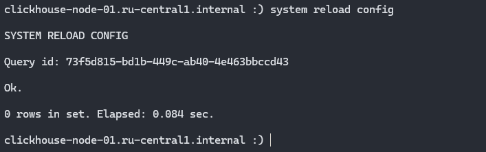

Проверим подключенные диски:

```sql
select * from system.disks
```

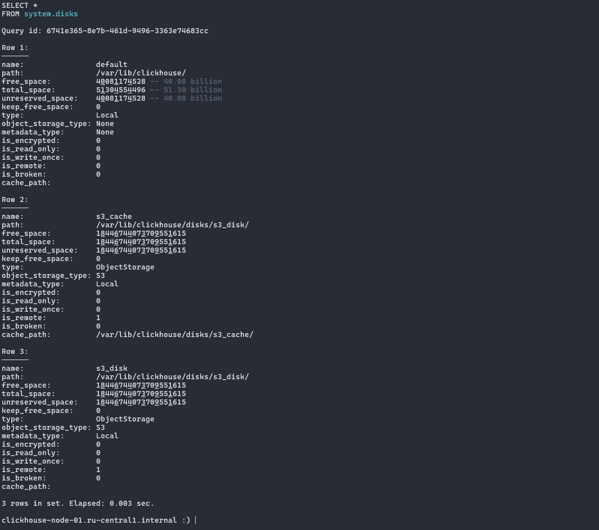

В списке результатов видим наш подключенный S3 диск.

## Создание тестовых данных

Будем использовать уже существующие данные базы данных из урока №7

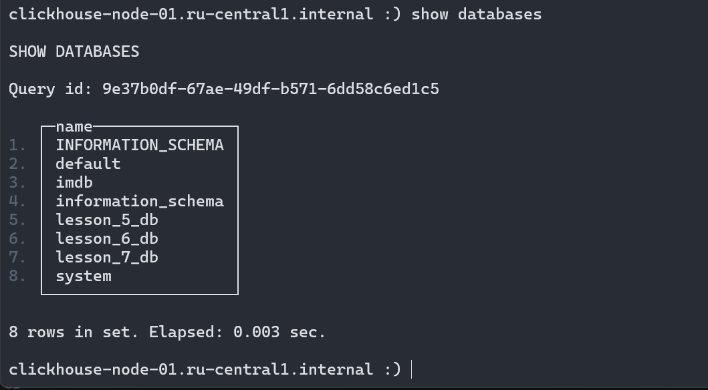

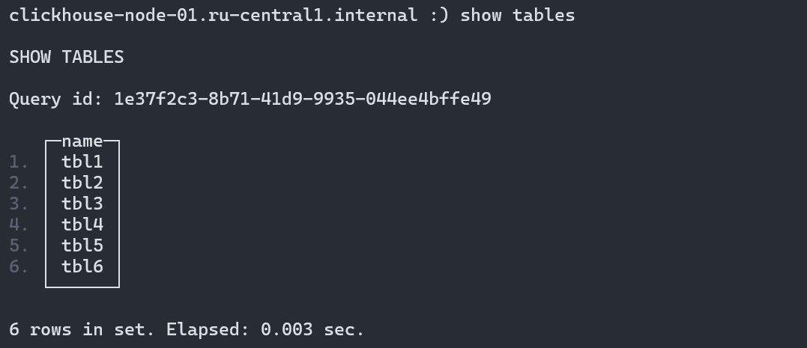

## Выполните резервное копирование на удалённый ресурс

Сгенерируем конфигурацию по-умолчанию утилиты `clickhouse-backup`:

```sh
sudo mkdir /etc/clickhouse-backup
sudo chown -R clickhouse:clickhouse /etc/clickhouse-backup/
sudo -u clickhouse clickhouse-backup default-config > /etc/clickhouse-backup/config.yml
sudo -u vi /etc/clickhouse-backup/config.yml
```

Заполним в конфигурации следующие параметры:

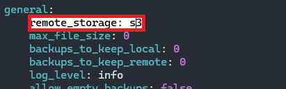

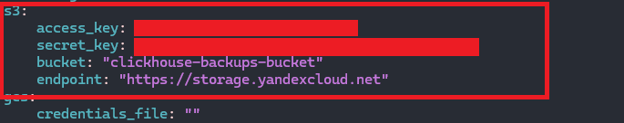

Выполним команды для создания и загрузки бэкапа в S3 диск:

```sh
clickhouse-backup create -t "lesson_7_db.*" lesson_7_db_backup
clickhouse-backup upload lesson_7_db_backup
```

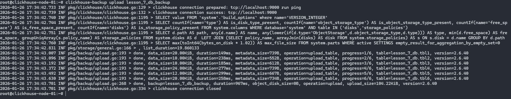

Увидим, что в интерфейсе Yandex Cloud в списке объектов появится наш бэкап:

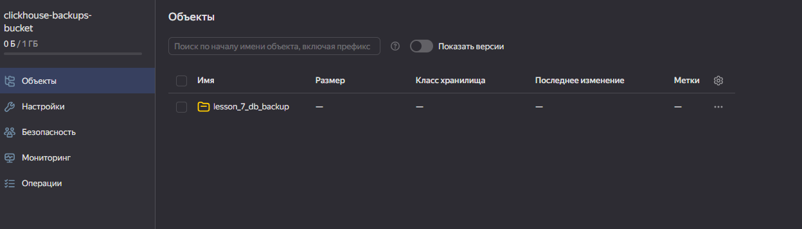

## Повреждение и восстановление данных из бэкапа

Удаление базы данных:

```sql
drop database lesson_7_db sync;
```

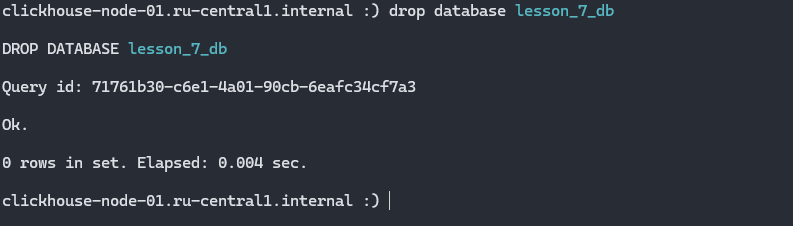

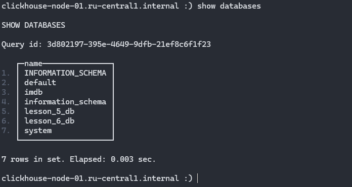

Восстановление базы данных из бэкапа в S3:

```sh
clickhouse-backup restore_remote lesson_7_db_backup -t "lesson_7_db.*"
```

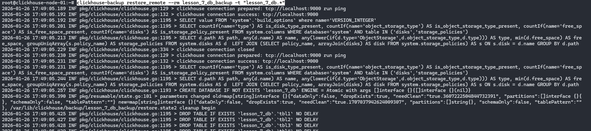

Проверим наличие базы данных после восстановления из бэкапа:

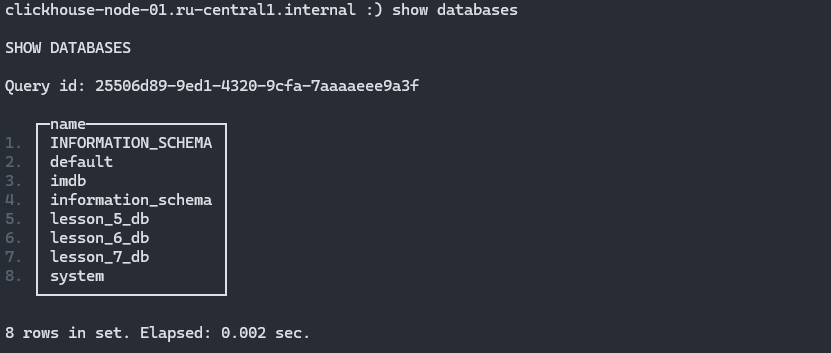

Все таблицы внутри базы данных `lesson_7_db` были восстановлены:

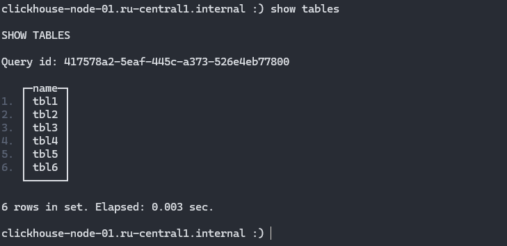
