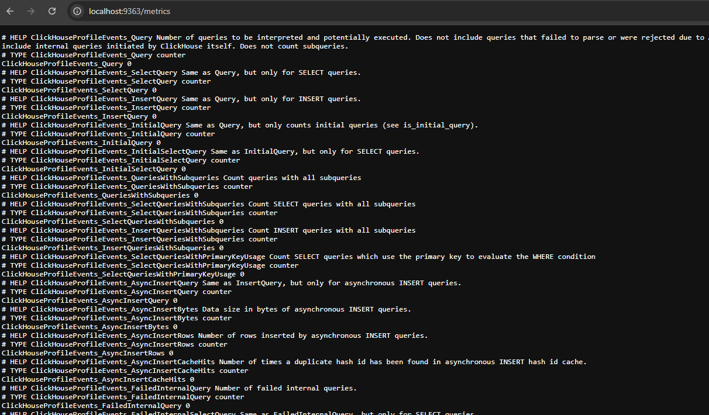
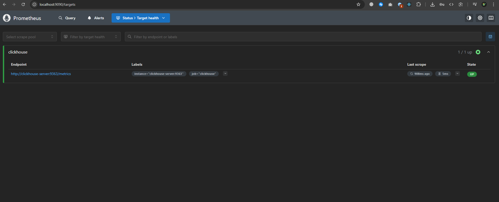
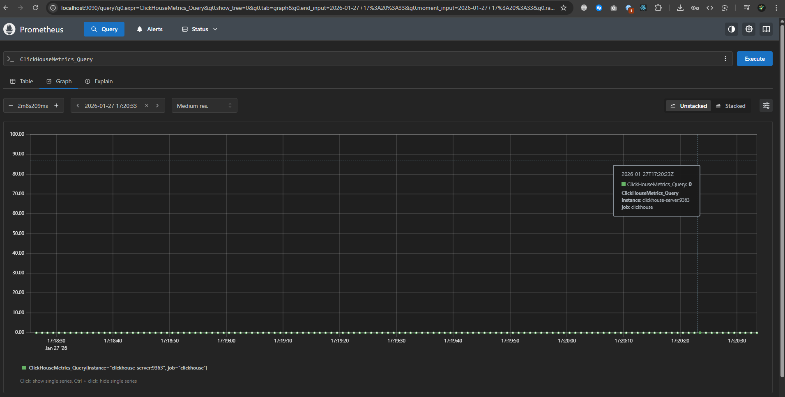

# Домашнее задание

## Подготовка сервисов

Мы будем использовать получение метрик ClickHouse из Prometheus. Для запуска всех сервисов одновременно будем использовать следующий [`docker-compose.yml`](./docker-compose.yml) файл:

```yml
version: '3.8'
services:
  clickhouse:
    image: clickhouse/clickhouse-server
    container_name: clickhouse-server
    ports:
      - "8123:8123"
      - "9000:9000"
      - "9363:9363"
    environment:
      - CLICKHOUSE_PASSWORD=123
    volumes:
      - ./prometheus_export.xml:/etc/clickhouse-server/config.d/prometheus_export.xml

  prometheus:
    image: prom/prometheus
    container_name: prometheus
    volumes:
      - ./prometheus.yml:/etc/prometheus/prometheus.yml
    ports:
      - "9090:9090"
```

Заполним  файл [`prometheus_export.xml`](./prometheus_export.xml) в котором будут определены настройки для отдачи метрик в Prometheus:

```xml
<clickhouse>
    <prometheus>
        <endpoint>/metrics</endpoint>
        <port>9363</port>
        <metrics>true</metrics>
        <events>true</events>
        <asynchronous_metrics>true</asynchronous_metrics>
        <status_info>true</status_info>
    </prometheus>
</clickhouse>
```

Заполним файл [`prometheus.yml`](./prometheus.yml) в котором будут определены настройки сбора данных из ClickHouse:

```yml
global:
  scrape_interval: 5s

scrape_configs:
  - job_name: 'clickhouse'
    static_configs:
      - targets: ['clickhouse-server:9363']
```

Запустим сервисы командой:

```sh
docker-compose up -d
```

## Проверка сбора метрик

Перейдем в браузере по адресу <http://localhost:9363/metrics>



Видим, что метрики успешно отдаются ClickHouse'ом

Перейдем на адрес <http://localhost:9090/targets>





Видим наш источник метрик `clickhouse` и пример графика метрики.
