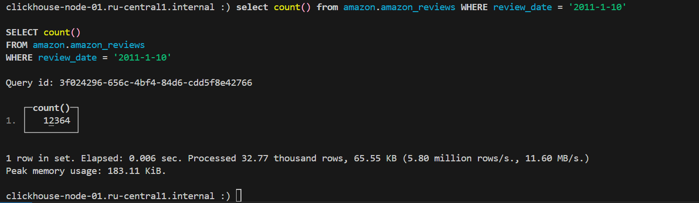
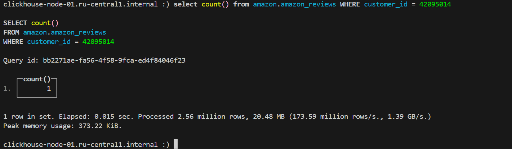
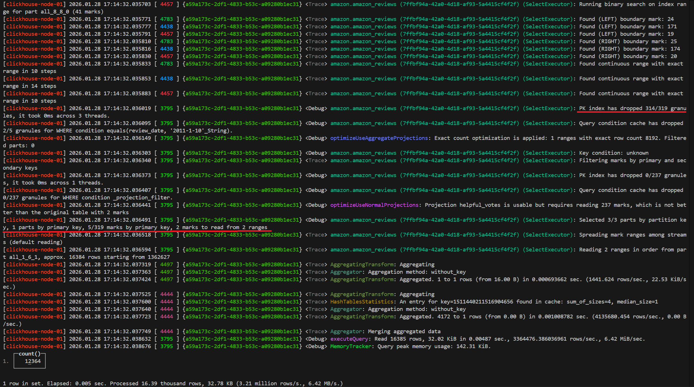
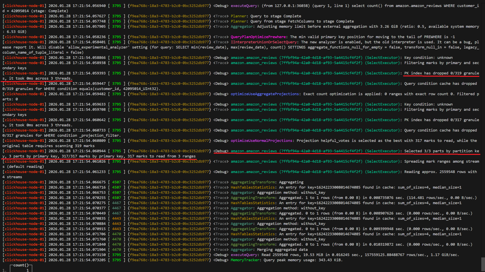
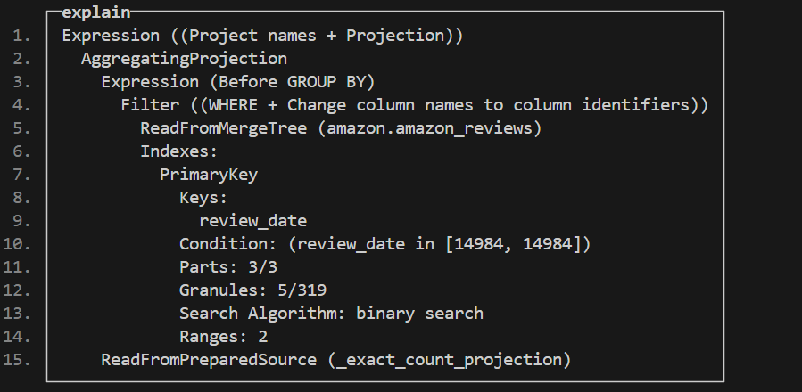
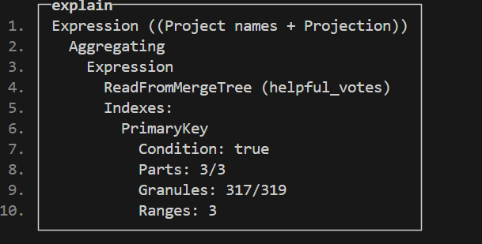

# Домашнее задание

## Наполнение данными

Возьмём датасет [Amazon Customer Review](https://clickhouse.com/docs/getting-started/example-datasets/amazon-reviews)

Подготовим таблицу:

```sql
CREATE DATABASE amazon

CREATE TABLE amazon.amazon_reviews
(
    `review_date` Date,
    `marketplace` LowCardinality(String),
    `customer_id` UInt64,
    `review_id` String,
    `product_id` String,
    `product_parent` UInt64,
    `product_title` String,
    `product_category` LowCardinality(String),
    `star_rating` UInt8,
    `helpful_votes` UInt32,
    `total_votes` UInt32,
    `vine` Bool,
    `verified_purchase` Bool,
    `review_headline` String,
    `review_body` String,
    PROJECTION helpful_votes
    (
        SELECT *
        ORDER BY helpful_votes
    )
)
ENGINE = MergeTree()
ORDER BY (review_date, product_category)
```

Наполним таблицу данными:

```sql
INSERT INTO amazon.amazon_reviews SELECT *
FROM s3('https://datasets-documentation.s3.eu-west-3.amazonaws.com/amazon_reviews/amazon_reviews_*.snappy.parquet')
```

## Выполнение запросов

### Запрос с условием WHERE, использующий первичный ключ

```sql
select count() from amazon.amazon_reviews WHERE review_date = '2011-1-10'
```



### Запрос с условием WHERE, не используя первичный ключ

```sql
select count() from amazon.amazon_reviews WHERE customer_id = 42095014
```



## Сравнение текстовых логов запросов

Включим текстовые логи запросов

```sql
SET send_logs_level = 'trace';
```

### Анализ запроса, использующий первичный ключ



Из всей таблицы ClickHouse читает лишь около 16 тыс. строк.

### Анализ запроса, не использующий первичный ключ



Из всей таблицы ClickHouse читает все 2 млн строк.

## Использование команды EXPLAIN

### Разбор запроса, использующий первичный ключ

```sql
explain indexes = 1 select count() from amazon.amazon_reviews WHERE review_date = '2011-1-10'
```



### Разбор запроса, не использующий первичный ключ

```sql
explain indexes = 1 select count() from amazon.amazon_reviews WHERE customer_id = 42095014
```


