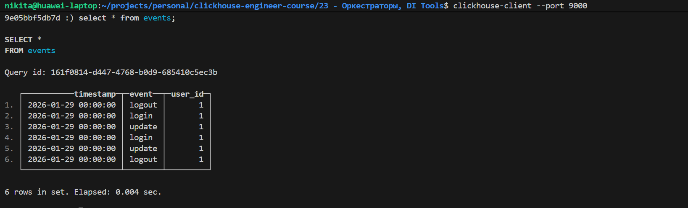

# Домашнее задание

## Подготовка сервисов

В данной работе будет использоваться ETL инструмент [**Vector**](https://vector.dev/).

В качестве источника данных мы будем использовать локальный файл с набором данных. Vector будет вычитывать его с помощью [file source'а](https://vector.dev/docs/reference/configuration/sources/file/) и отправлять данные в ClickHouse с помощью [clickhouse sink'а](https://vector.dev/docs/reference/configuration/sinks/clickhouse/).

Будем использовать следующий [`docker-compose.yml`](./docker-compose.yml) файл:

```yaml
services:
  clickhouse:
    image: clickhouse/clickhouse-server
    ports:
      - "8123:8123"
      - "9000:9000"
    environment:
      - CLICKHOUSE_PASSWORD=123
    healthcheck:
      test: ["CMD", "wget", "--spider", "-q", "localhost:8123/ping"]
      interval: 5s
      timeout: 5s
      retries: 5

  vector:
    image: timberio/vector:latest-debian
    depends_on:
      clickhouse:
        condition: service_healthy
    volumes:
      - ./vector.yml:/etc/vector/vector.yml:ro
      - ./data.ndjson:/tmp/data.ndjson:ro
      - ./vector.yaml:/etc/vector/vector.yaml:ro
      - ./data.jsonl:/tmp/data.jsonl:ro
```

Определим конфигурацию приложения Vector для вычитки данных из файла. Сохраним следующее содержимое в файл [`vector.yaml`](./vector.yaml):

```yml
sources:
  file_in:
    type: "file"
    include: ["/tmp/data.ndjson"]
    read_from: "beginning"

transforms:
  parse:
    type: "remap"
    inputs: ["file_in"]
    source: |
      parsed = parse_json!(.message)
      # ПОЛНАЯ ОЧИСТКА: удаляем всё, включая системные поля Vector
      . = {} 
      .timestamp = parsed.timestamp
      .event = parsed.event
      .user_id = to_int!(parsed.user_id)

sinks:
  ch_out:
    type: "clickhouse"
    inputs: ["parse"]
    endpoint: "http://clickhouse:8123"
    table: "events"
    auth:
      strategy: "basic"
      user: "default"
      password: "123"
```

Добавим файл с тестовыми данными [`data.ndjson`](./data.ndjson):

```json
{"timestamp": "2026-01-29", "event": "login", "user_id": 1}
{"timestamp": "2026-01-29", "event": "update", "user_id": 1}
{"timestamp": "2026-01-29", "event": "logout", "user_id": 1}
```

## Запуск сервисов

Выполним запуск всех сервисов следующей командой:

```sh
docker-compose up -d
```

## Подготовка таблицы

Подключимся к ClickHouse утилитой clickhouse-client:

```sh
clickhouse-client --port 9000
```

Создадим таблицу `events` в ClickHouse:

```sql
CREATE TABLE events (
    timestamp DateTime,
    event String,
    user_id UInt64
) ENGINE = MergeTree() 
ORDER BY timestamp;
```

## Проверка работы

Добавим новые строки в файл [`data.ndjson`](./data.ndjson)

Проверим поступление данных в таблицу `events`:

```sql
select * from events;
```


