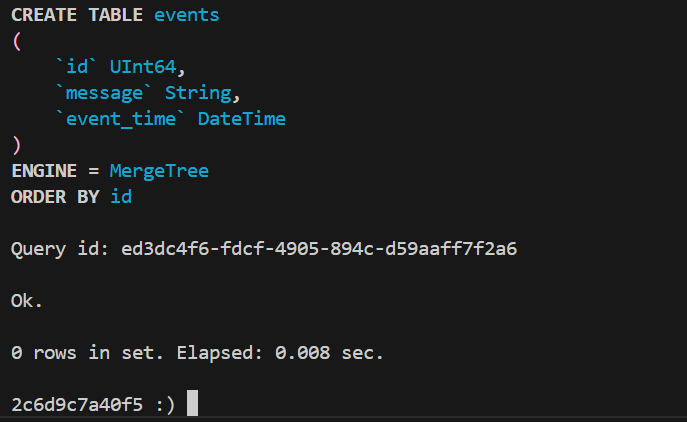
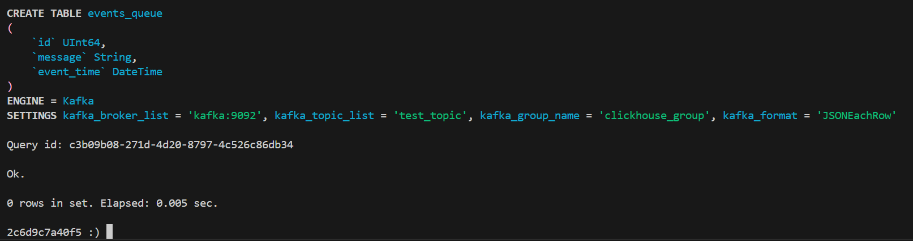
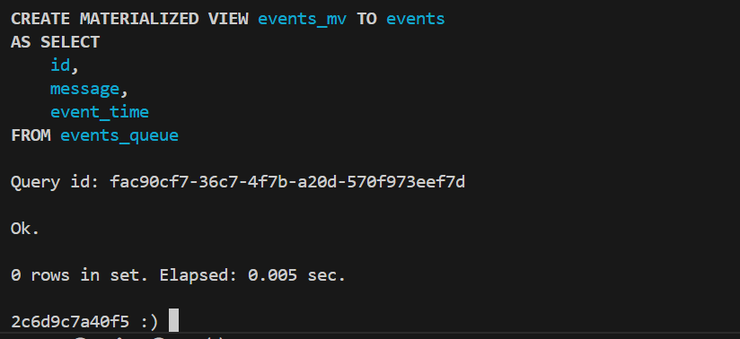
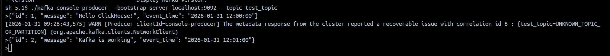
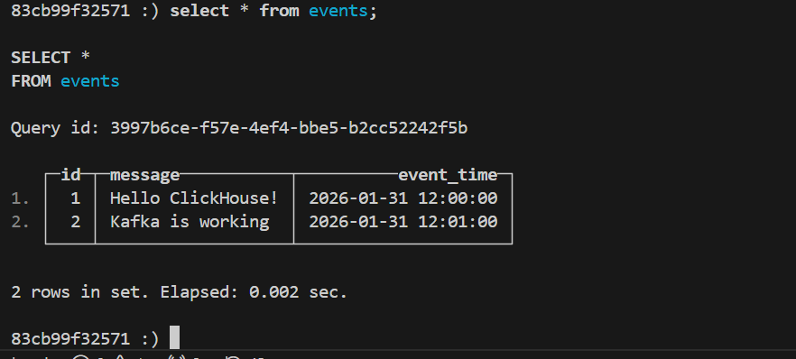

# Домашнее задание

## Подготовка сервисов

В данной работе нам необходимо два отдельных сервиса: ClickHouse и Kafka.

Будем использовать следующий [`docker-compose.yml`](./docker-compose.yml) файл:

```yml
version: '3.8'
services:
  kafka:
    image: confluentinc/cp-kafka
    ports:
      - "9092:9092"
    environment:
      KAFKA_NODE_ID: 1
      KAFKA_PROCESS_ROLES: 'broker,controller'
      KAFKA_CONTROLLER_QUORUM_VOTERS: '1@kafka:9093'
      KAFKA_CONTROLLER_LISTENER_NAMES: 'CONTROLLER'

      KAFKA_LISTENERS: 'PLAINTEXT://:9092,CONTROLLER://:9093'
      KAFKA_ADVERTISED_LISTENERS: 'PLAINTEXT://kafka:9092'
      KAFKA_LISTENER_SECURITY_PROTOCOL_MAP: 'CONTROLLER:PLAINTEXT,PLAINTEXT:PLAINTEXT'
      KAFKA_INTER_BROKER_LISTENER_NAME: 'PLAINTEXT'

      CLUSTER_ID: 'MkU3OTM3OThmNmM3NDQ3Nzk' 
      KAFKA_OFFSETS_TOPIC_REPLICATION_FACTOR: 1

  clickhouse:
    image: clickhouse/clickhouse-server
    ports:
      - "8123:8123"
      - "9000:9000"
    environment:
      - CLICKHOUSE_PASSWORD=123
```

Запуск сервисов:

```sh
docker-compose up -d
```

## Настройка ClickHouse для работы с Kafka

### Создание целевой таблицы

```sql
CREATE TABLE events (
    id UInt64,
    message String,
    event_time DateTime
) ENGINE = MergeTree()
ORDER BY id;
```



### Создание таблицы с движком Kafka

```sql
CREATE TABLE events_queue (
    id UInt64,
    message String,
    event_time DateTime
) ENGINE = Kafka
SETTINGS kafka_broker_list = 'kafka:9092',
         kafka_topic_list = 'test_topic',
         kafka_group_name = 'clickhouse_group',
         kafka_format = 'JSONEachRow';
```



### Создание Materialized View

```sql
CREATE MATERIALIZED VIEW events_mv TO events AS
SELECT id, message, event_time
FROM events_queue;
```



## Запись данных в Kafka

Выполним запуск скрипта `kafka-console-producer` для вставки событий в Kafka через консоль:

```sh
docker exec -it $(docker ps -qf "name=kafka") /usr/bin/kafka-console-producer --bootstrap-server localhost:9092 --topic test_topic
```

```json
{"id": 1, "message": "Hello ClickHouse!", "event_time": "2026-01-31 12:00:00"}
{"id": 2, "message": "Kafka is working", "event_time": "2026-01-31 12:01:00"}
```



## Проверка данных из Kafka в ClickHouse

```sql
SELECT * FROM events; 
```



Как видим записанные строки попали в целевую таблицу в ClickHouse.
