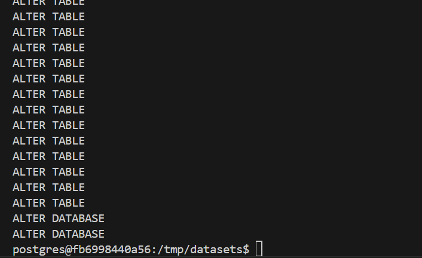
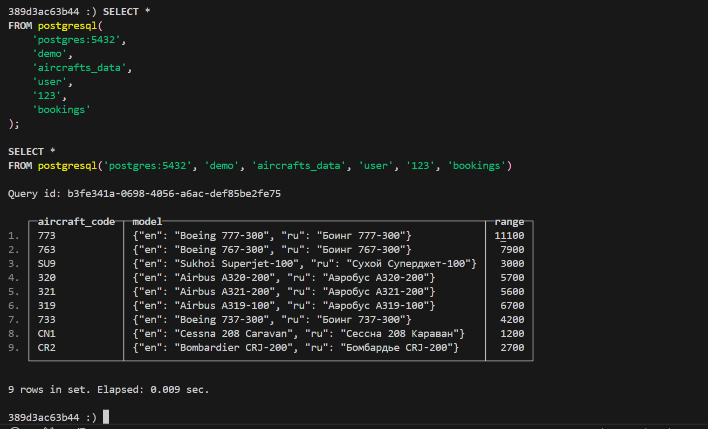
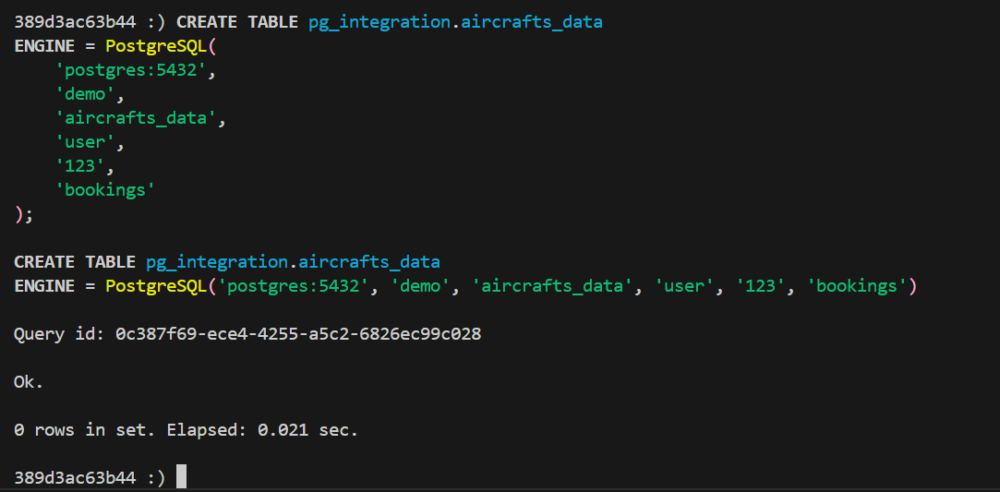
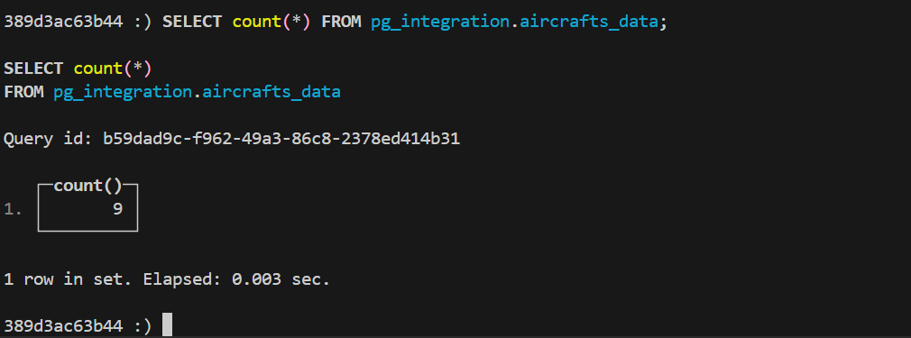

# Домашнее задание

## Подготовка сервисов

В данной работе нам необходимо два отдельных сервиса: ClickHouse и PostgreSQL.

Будем использовать следующий [`docker-compose.yml`](./docker-compose.yml) файл:

```yml
version: "3.8"

services:
  clickhouse:
    image: clickhouse/clickhouse-server
    container_name: clickhouse
    ports:
      - "8123:8123"
      - "9000:9000"
    environment:
      - CLICKHOUSE_PASSWORD=123

  postgres:
    image: postgres:15
    environment:
      POSTGRES_DB: test
      POSTGRES_USER: user
      POSTGRES_PASSWORD: 123
    ports:
      - "5432:5432"
```

Запустим сервисы:

```sh
docker-compose up -d
```

## Загрузка тестового датасета в PostgreSQL

Подключимся к контейнеру с PostgresSQL:

```sh
docker exec -it fb699844 bash
```

Выполним следующие команды:

```sh
apt-get update
apt-get install wget
wget https://edu.postgrespro.com/demo-big-en.zip
apt-get install unzip
unzip demo-big-en.zip -d /tmp/datasets/
psql -U user -d test -f /tmp/datasets/demo-big-en-20170815.sql
```



## Запрос данных из PostgreSQL с помощью функции postgres в ClickHouse

Отключимся от контейнера с PostgresSQL и подключимся к контейнеру с ClickHouse:

```sh
clickhouse-client --port 9000
```

Запросим данные:

```sql
SELECT *
FROM postgresql(
    'postgres:5432',
    'demo',
    'aircrafts_data',
    'user',
    '123',
    'bookings'
);
```



## Создание базы  данных и таблицы на стороне ClickHouse для интеграции с PostgreSQL через движок Postgres

```sql
CREATE DATABASE IF NOT EXISTS pg_integration;

CREATE TABLE pg_integration.aircrafts_data
ENGINE = PostgreSQL(
    'postgres:5432',
    'demo',
    'aircrafts_data',
    'user',
    '123',
    'bookings'
);
```



Проверка обращения к данным:

```sql
SELECT count(*) FROM pg_integration.aircrafts_data;
```


